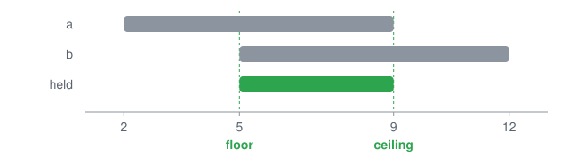

<p align="center"></p>

# @lapxo/obligations

      [](https://doi.org/10.5281/zenodo.21858428)

The algebra of a cell: two poles, origins with phase, eight acts.

## The idea

Every quantity a system answers for has two marks on one scale. The floor is what must hold, the ceiling is what may hold, and the pair is a cell. Two origins that touch one cell and whose marks meet make information; two whose marks do not meet make a fork that no average can close.

Four words carry the whole library. A floor, a ceiling, an origin and an epoch. A price is the distance between the marks, a state is where they stand, a verdict is what an origin found, a horizon is what no origin has reached, and none of them is a new idea: each is read off those four.

<p align="center"></p>

A cell is drawn as bars on one scale: a grey bar is what one origin claims, potential until another meets it, and a green bar is where two claims meet, its ends the floor and the ceiling. A state carries its render in a figure, a badge and a graph alike: FREE green, REQUIRED grey, FORBIDDEN red, CONFLICT fork.

## The object

```text
c = ⟨⊥, ⊤, O, ⊑⟩        over L at r
⊥(c)                   = ⋁ required ∨ ⋁_{o∈O} lo_o
⊤(c)                   = ⋀ signed ∧ ⋀_{o∈O} hi_o
info(c)                ⟺ |ext(O)| ≥ 2 ∧ meet(c) ≠ ∅
F(C)                   = Σ_{c∈C} F(c),   F(a(c)) ≤ F(c) for every act a that narrows
A(c)                   = |Σ_{o∈O} s_o w_o e^{iφ_o}|²
⊤(c)                   = ⋀_{b ⊑ c} signed(b) ∧ ⋀_{o∈O} hi_o,   one line per act
|e^{ia} + e^{ib}|² < 2 ⟺ |a − b| > π/2
state(c)               ∈ {FREE, REQUIRED, FORBIDDEN, CONFLICT}
```

```text
bounds that cross                        CONFLICT   ⋔
one origin                               REQUIRED   ○
claims that do not meet                  CONFLICT   ⋔
claims that meet and fit the bounds      FREE       ●
claims that meet outside the bounds      FORBIDDEN  ✕
```

## What holds

The theory of this package is ten axioms and what follows from them. Three of them, the ones the rest leans on hardest, read like this.

A claim from one origin is potential; a cell is information only where two independent origins touch it and their intervals meet. That is encounter, and 28 lines of the lock rest on it.

Two bounds on one cell fold by the meet of their form; the order they arrive in never decides. That is meet, and 19 lines of the lock rest on it.

Every quantity has two poles, a floor that is required and a ceiling that is permitted, and a cell is the pair. That is carrier, and 17 lines of the lock rest on it.

<details><summary>The other seven, each one line of the lock with a sample that shows it and one that would break it</summary>

- **resolution** — every observation has a scale; hierarchy is resolution; a coordinate's depth is its resolution.
- **epoch** — every claim carries when it holds; order is causal, never a clock.
- **origin is extension** — an origin is the set of (coordinate, interval) it has produced; two origins with one extension are one; independence is distance between extensions.
- **vacuity** — a region no origin touches for an epoch contracts; nothing keeps a cell alive but a new observation.
- **four states** — one origin is required; two or more that meet within the ceiling are free; that meet outside it are forbidden; that do not meet are in conflict; fewer states collapse two of them.
- **everything is a bound** — one relation: an origin bounds a cell at a resolution and an epoch; cells, origins, locks and laws are cells under it; the relation bounds itself, and there is no level above it.
- **freedom conserved** — the freedom of a system is the sum of its cells' debits in bits; an encounter never raises it; only a new coordinate does.

</details>

One theorem shows the theory meeting its own measurement. An independent second origin never raises a cell's debit: it falls by log2 of the states it leaves standing, a full bit exactly when it admits at most half of them, and nothing exactly when it narrows nothing. Between the two there is a drop that is neither: fifteen of sixteen states costs 0.0931 of a bit.

```bash
npm install @lapxo/obligations
```

## Try it

The shortest example this package ships, withdrawal, and what it prints.

```ts
import { intervals } from '@lapxo/obligations/forms';
import { cell, encounter, meet, observe } from '@lapxo/obligations/views/field';

const scale = intervals(0, 20);
const held = cell('x', 0, [{ id: 'k1', origin: 'a', span: { lo: 2, hi: 9 } }, { id: 'k2', origin: 'b', span: { lo: 5, hi: 12 } }]);
const back = observe(held, { origin: 'b', span: { lo: 5, hi: 12 }, takes: 'k2' });

console.log('two origins ', encounter(scale, held).origins, JSON.stringify(meet(scale, held)));
console.log('b takes k2  ', encounter(scale, back).origins, JSON.stringify(meet(scale, back)));
console.log('claims kept ', back.seen.length);
console.log('why       a withdrawal names the claim it takes back, so the cell returns to one origin while all three claims stay on it and nothing is matched by looking like something');
```

```
two origins  2 {"lo":5,"hi":9}
b takes k2   1 {"lo":2,"hi":9}
claims kept  3
why       a withdrawal names the claim it takes back, so the cell returns to one origin while all three claims stay on it and nothing is matched by looking like something
```

## How to read it

One lattice is read through several views, and each answers one question.

<details><summary>The ten views and the question each answers</summary>

- **chain** — how finely a cell is resolved and how it moves along its scale.
- **complement** — what can be taken back exactly.
- **dual** — what the permitted side says on its own.
- **field** — where a bound is held and by whom.
- **galois** — what is determined by what.
- **ideal** — what a cell requires and permits, what two claims hold together, what a declaration decomposes into, and how much freedom is left between its two poles, in bits.
- **product** — how a region decomposes.
- **quotient** — what is lost and what is kept when a bound is read coarser.
- **spectrum** — which values can occur.
- **valuation** — what a bound is worth.

</details>

## The paper

The theory here is not an application of an algebra to a problem. It is one algebra, of a cell with two marks, and three theories that turn out to be that algebra seen from different sides: constraints with a price, states on a scale, and points with an epoch and an origin.

What it proves is that the price of a fold, the freedom of a system in bits, the four states a verdict can hold, the spectrum a domain admits, the metric that shared observation induces and the phase an epoch carries are all consequences of the same lines. Each law names the view that implements it, and each view is a folder of the source: what is proved in the field view runs in the field view, and a law no operation reaches is a law this package refuses to claim.

Ochoa, N. (2026). Two-Sided Constraints on a Valued Lattice (Version 1.0.0). Zenodo. https://doi.org/10.5281/zenodo.21858428

## What is open

Nine lines are conjectures: nothing rests on them, and each names what would break it.

Two for a ledger:

- **Uncertainty** — a cell cannot be both arbitrarily fine and arbitrarily well seen. *Breaks if the product rises as reading sharpens.*
- **Density attracts** — reading lands where reading already is. *Breaks if encounters land blind to density.*

Two for a mathematician:

- **Enriched semilattice** — cells under rest, signatures as meets, phase as enrichment. *Breaks if two operations compose undetermined.*
- **Maximal** — remove a part and a known object remains; add one and the four states break. *Breaks if a part keeps both.*

Five readings:

- **A distant signature moves a cell that did not move** — a hint, never a claim. *Breaks if one act is both local and non-local.*
- **Amplitudes without an origin** — what is left of a cell when who, ceiling, resolution and band are dropped. *Breaks if the arithmetic forbids what the restored fields predict.*
- **Measurement** — a thermometer, a survey, an interferometer and a headcount fill the same five fields. *Breaks if one instrument cannot.*
- **The medium of encounters** — what carries an encounter is a medium, and a medium is what two origins can both reach: in each instrument the medium can be named and the encounter happens where two origins touch it and nowhere else, so two origins at one cell make information and the same two at two cells make none; structural resemblance, one origin, not a claim about the world. *Breaks if two origins meet with nothing they both reach.*
- **Refereed game** — a field of cells with origins and signatures is a game whose referee is inside it: a move is a claim, a claim alone is potential, two that meet are information, a signature moves every cell that rests on it, and no player may suspend the rule that makes the first four; the claim is that each of five readings of the field matches all five properties; structural resemblance, one origin, not a claim about the world. *Breaks if a player can suspend the rule that two origins are needed.*

<details><summary>Every conjecture in full</summary>

Resolution times independent encounters per cell stays above a floor c; the sufficient resolution is where the product saturates. The falsifier: a cell read at four resolutions whose product of resolution and independent encounters comes out above the floor while the encounters fall away with the sharpening. A product that rises as the reading sharpens would say the floor is not a floor but an accident of how coarsely the cell was read.

Where reading already is, the next reading lands: over eight epochs of placement in proportion to the origins a cell already carries, the ratio between the densest tenth and the sparsest rises at every epoch and the deserts stay empty, while the same budget placed blind to density holds that ratio near two and touches three times as many cells. The falsifier: encounters that land independently of the density already there. Then the ratio does not rise with the epochs and the cells touched grow with the budget, which is what the blind placement in the yes sample shows.

Stated as a hint and never as a claim about the world: if what is is a field of floors and ceilings, a distant signature changes a cell whose own record never moved, and in two hundred trials of one cell holding one value the verdict came out both ways, so nothing stored at the cell explains the difference and what explains it is the bound the cell rests on; the resemblance is structural and never arithmetic, with no continuous amplitudes and no inequality violated by number; structural resemblance, one origin, not a claim about the world. The falsifier: one act that is both local and non-local — a change that travels a distance and also reaches a cell that does not rest on its bound. The two poles would then be one, and this would be a claim about the world rather than a hint.

The cells under the order of rest, with signatures as meets and the phase each origin carries as what they are enriched over, look like an enriched meet-semilattice, and what this library proves would be its representation theory; identity, composition, associativity, commuting and naturality hold for the operations as vectors, while observation is not one of them — it moves the metric and can split a cell no signature could, so it is a functor out of the category and not an arrow inside it, and the join, which does not travel, is a second kind of arrow this conjecture does not name. The falsifier: a pair of the five operations whose composition the axioms do not determine. The join is already known to be absent from them: it does not travel, and naming what it is would be a second kind of arrow this conjecture does not have.

Amplitudes with a phase and no origin, no signed ceiling, no resolution and no epoch band are what is left of a cell when those four fields are dropped, so the measurement problem is the absence of who, imposed symmetries the absence of a signed ceiling, the classical limit the absence of resolution and universal interference the absence of bands; restored, four claims in phase keep exactly the share of the whole their number leaves them against an environment spread over the period, and six origins around one value are six objects read finely and one read coarsely, so how many things there are is a reading; structural resemblance, one origin, not a claim about the world. The falsifier: a result of the usual formalism that cannot be stated with the four fields, or a prediction the restored fields make that the arithmetic forbids. This conjecture is about which structure is missing, not about numbers the arithmetic already gives.

Four instruments that share no mechanism fold the same way because a measurement is a cell: for a thermometer, a survey, an interferometer and a headcount the five fields are named without strain and the same five operations answer for all four; no number is claimed, only that the table can be filled in every row. The falsifier: an instrument whose reading cannot be written as a floor and a ceiling held by an origin at an epoch and a resolution, without straining any of the five.

What carries an encounter is a medium, and a medium is what two origins can both reach: in each instrument the medium can be named and the encounter happens where two origins touch it and nowhere else, so two origins at one cell make information and the same two at two cells make none; structural resemblance, one origin, not a claim about the world. The falsifier: an encounter between two origins with nothing they both reach. Then information would appear where nothing was shared.

A field of cells with origins and signatures is a game whose referee is inside it: a move is a claim, a claim alone is potential, two that meet are information, a signature moves every cell that rests on it, and no player may suspend the rule that makes the first four; the claim is that each of five readings of the field matches all five properties; structural resemblance, one origin, not a claim about the world. The falsifier: a reading of the field where a player can suspend the rule that two origins are needed, or where one claim is information. Then the referee would be outside the game.

The obligatory is maximal: take away any one of its seven parts and what is left is an object already known, and anything added to it is either already inside it or breaks the four states. The falsifier: a part the obligatory lacks that keeps the four states and the six operations and is not a reading of one of them.

</details>

## Check

● 203 cases hold
