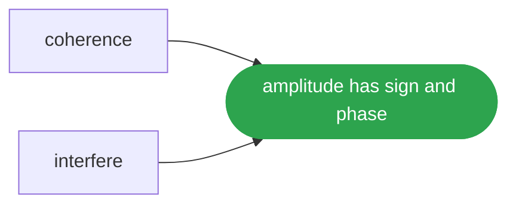

# In phase

A claim carries a size and a direction, how much it narrows and the turn it landed on, and a withdrawal is the same size the other way: two hundred claims in phase make the square of their number and the same two hundred strewn make its order, while a write and its withdrawal at one epoch leave nothing and at different epochs do not cancel.

## Run it

```ts
import { coherence, interfere } from '@lapxo/obligations/views/field';

const span = { lo: 0, hi: 0 };
let held = 11;
const next = (): number => { held = (held * 1103515245 + 12345) % 2147483648; return held / 2147483648; };
const together = Array.from({ length: 32 }, (_, i) => ({ origin: `o${i}`, epoch: 8, span }));
const strewn = Array.from({ length: 32 }, (_, i) => ({ origin: `o${i}`, epoch: Math.floor(next() * 8), span }));

console.log('in phase  ', interfere(together, 8), 'coherence', coherence(together, 8).toFixed(2));
console.log('strewn    ', interfere(strewn, 8).toFixed(0), 'coherence', coherence(strewn, 8).toFixed(2));
console.log('their number is 32, and its square is', 32 ** 2);
console.log('why       claims that land at one turn of the period add as the square of their number, and the same claims strewn across it add as its order');
```

```
in phase   1024 coherence 1.00
strewn     50 coherence 0.22
their number is 32, and its square is 1024
why       claims that land at one turn of the period add as the square of their number, and the same claims strewn across it add as its order
```

## What it rests on



## Source

[Its source](../../examples/release/in-phase.ts) is one of the examples of obligations, its output pinned by the lock, and it runs as it is written, against the built package, with nothing compiled for it.
