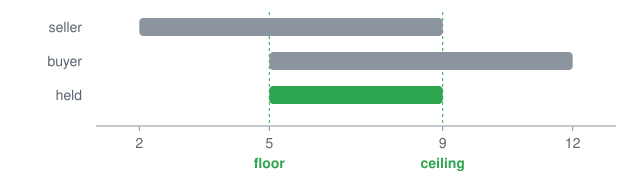
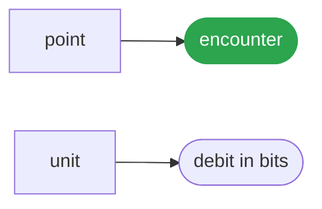

# Price

<p align="center"></p>

A claim from one origin is potential; a cell is information only where two independent origins touch it and their intervals meet.

## Run it

```ts
import { chain, disagree, freedom, meetAt, origins, point, unit } from '@lapxo/obligations';

const said = (cell: Parameters<typeof meetAt>[0]): string =>
  (origins(cell) < 2 ? 'grey' : disagree(cell) ? 'split' : 'agreed');

const price = point('price', 0, [
  { origin: 'seller', span: { lo: 2, hi: 9 } },
  { origin: 'buyer', span: { lo: 5, hi: 12 } },
]);
const scale = chain(Array.from({ length: 16 }, (_, i) => `l${i}`));

console.log('verdict   ', said(price));
console.log('they hold ', JSON.stringify(meetAt(price)));
console.log('still free', freedom(scale, unit('price', { floor: 'l5', ceiling: 'l9' })).toFixed(2), 'bits');
console.log('why       a seller and a buyer are two origins; where their marks meet is a price, and what is left between the marks is what nobody has decided yet');
```

```
verdict    agreed
they hold  {"lo":5,"hi":9}
still free 2.32 bits
why       a seller and a buyer are two origins; where their marks meet is a price, and what is left between the marks is what nobody has decided yet
```

## What it rests on



## Source

[Its source](../../examples/release/price.ts) is one of the examples of obligations, its output pinned by the lock, and it runs as it is written, against the built package, with nothing compiled for it.
