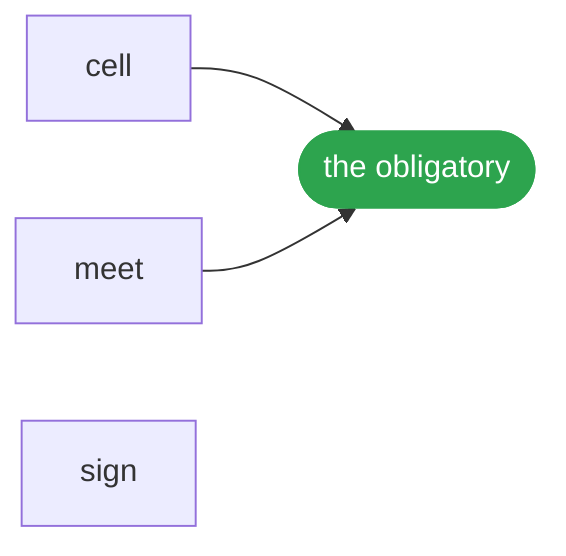

# Signature



The object is c = ⟨⊥, ⊤, O, ⊑⟩ over L at r: four parts in two pairs, the value (⊥, ⊤) and the relations (O, ⊑), with the lattice L it is given and the resolution r it is read at belonging to the reading and the sign to the act; an origin is (o, φ), and the poles are read, never stored: ⊥ is what is required joined with what its live claims hold, ⊤ what is signed met with what they allow; eight acts in four pairs and seven names answer for it: meet and join on the ceiling, local, a join only with a witness; observe and withdraw on the floor, local, a withdrawal being an observation at −1 that restores exactly; sign and require on both poles, travelling by rest, commuting and both closing freedom; encounter and refine with no pole; and no widening travels.

## Run it

```ts
import { intervals } from '@lapxo/obligations/forms';
import { cell, meet, sign } from '@lapxo/obligations/views/field';

const scale = intervals(0, 100);
const world = [0, 1, 2, 3].map((i) => cell(`c${i}`, 0, [{ origin: `own${i}`, span: { lo: 20 * i, hi: 100 } }], ['ceiling']));
const before = new Map([['ceiling', cell<{ lo: number; hi: number }>('ceiling')]]);
const after = sign(scale, before, 'ceiling', { lo: 0, hi: 45 });

console.log('cells resting on the ceiling', world.filter((one) => one.restsOn.includes('ceiling')).length);
for (const [i, one] of world.entries()) {
  console.log(`c${i} before`, JSON.stringify(meet(scale, one, before)), '· after', JSON.stringify(meet(scale, one, after)));
}
console.log('claims edited by the signature', world.flatMap((one) => one.seen).filter((claim) => claim.span.hi !== 100).length);
console.log('why       one signature narrows a bound and every cell resting on it reads the narrower one, without touching a single claim any origin made');
```

```
cells resting on the ceiling 4
c0 before {"lo":0,"hi":100} · after {"lo":0,"hi":45}
c1 before {"lo":20,"hi":100} · after {"lo":20,"hi":45}
c2 before {"lo":40,"hi":100} · after {"lo":40,"hi":45}
c3 before {"lo":60,"hi":100} · after {"lo":60,"hi":45}
claims edited by the signature 0
why       one signature narrows a bound and every cell resting on it reads the narrower one, without touching a single claim any origin made
```

## Source

[Its source](../../examples/release/signature.ts) is one of the examples of obligations, its output pinned by the lock, and it runs as it is written, against the built package, with nothing compiled for it.
