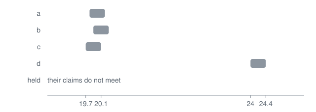
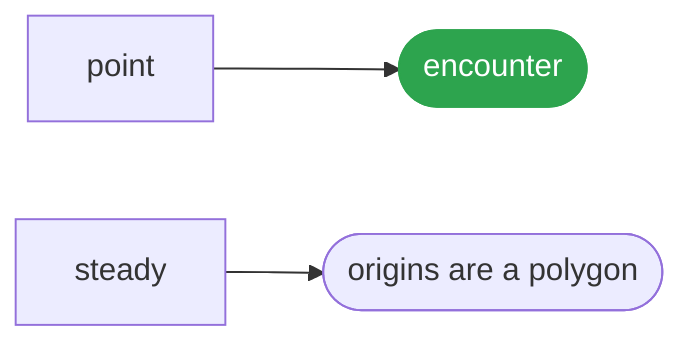

# Thermometer

<p align="center"></p>

A claim from one origin is potential; a cell is information only where two independent origins touch it and their intervals meet.

## Run it

```ts
import { disagree, origins, point } from '@lapxo/obligations';
import { steady } from '@lapxo/obligations/views/product';

const said = (cell: ReturnType<typeof point>): string =>
  (origins(cell) < 2 ? 'grey' : disagree(cell) ? 'split' : 'agreed');

const bath = point('bath', 0, [
  { origin: 'a', span: { lo: 19.8, hi: 20.2 } },
  { origin: 'b', span: { lo: 19.9, hi: 20.3 } },
  { origin: 'c', span: { lo: 19.7, hi: 20.1 } },
  { origin: 'd', span: { lo: 24.0, hi: 24.4 } },
]);
const without = (name: string) => point('bath', 0, bath.seen.filter((one) => one.origin !== name));

console.log('four thermometers', said(bath));
for (const one of ['a', 'b', 'c', 'd']) console.log(`without ${one}        `, said(without(one)));
console.log('holds without any one of them:', steady(bath));
console.log('why       leaving one out names the instrument that disagrees, and a verdict that needs every origin is not a verdict');
```

```
four thermometers split
without a         split
without b         split
without c         split
without d         agreed
holds without any one of them: false
why       leaving one out names the instrument that disagrees, and a verdict that needs every origin is not a verdict
```

## What it rests on



## Source

[Its source](../../examples/release/thermometer.ts) is one of the examples of obligations, its output pinned by the lock, and it runs as it is written, against the built package, with nothing compiled for it.
