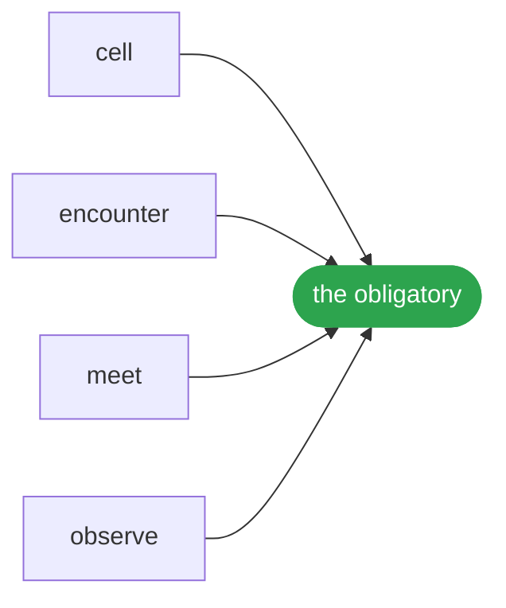

# Withdrawal

<p align="center"></p>

The object is c = ⟨⊥, ⊤, O, ⊑⟩ over L at r: four parts in two pairs, the value (⊥, ⊤) and the relations (O, ⊑), with the lattice L it is given and the resolution r it is read at belonging to the reading and the sign to the act; an origin is (o, φ), and the poles are read, never stored: ⊥ is what is required joined with what its live claims hold, ⊤ what is signed met with what they allow; eight acts in four pairs and seven names answer for it: meet and join on the ceiling, local, a join only with a witness; observe and withdraw on the floor, local, a withdrawal being an observation at −1 that restores exactly; sign and require on both poles, travelling by rest, commuting and both closing freedom; encounter and refine with no pole; and no widening travels.

## Run it

```ts
import { intervals } from '@lapxo/obligations/forms';
import { cell, encounter, meet, observe } from '@lapxo/obligations/views/field';

const scale = intervals(0, 20);
const held = cell('x', 0, [{ id: 'k1', origin: 'a', span: { lo: 2, hi: 9 } }, { id: 'k2', origin: 'b', span: { lo: 5, hi: 12 } }]);
const back = observe(held, { origin: 'b', span: { lo: 5, hi: 12 }, takes: 'k2' });

console.log('two origins ', encounter(scale, held).origins, JSON.stringify(meet(scale, held)));
console.log('b takes k2  ', encounter(scale, back).origins, JSON.stringify(meet(scale, back)));
console.log('claims kept ', back.seen.length);
console.log('why       a withdrawal names the claim it takes back, so the cell returns to one origin while all three claims stay on it and nothing is matched by looking like something');
```

```
two origins  2 {"lo":5,"hi":9}
b takes k2   1 {"lo":2,"hi":9}
claims kept  3
why       a withdrawal names the claim it takes back, so the cell returns to one origin while all three claims stay on it and nothing is matched by looking like something
```

## What it rests on



## Source

[Its source](../../examples/release/withdrawal.ts) is one of the examples of obligations, its output pinned by the lock, and it runs as it is written, against the built package, with nothing compiled for it.
