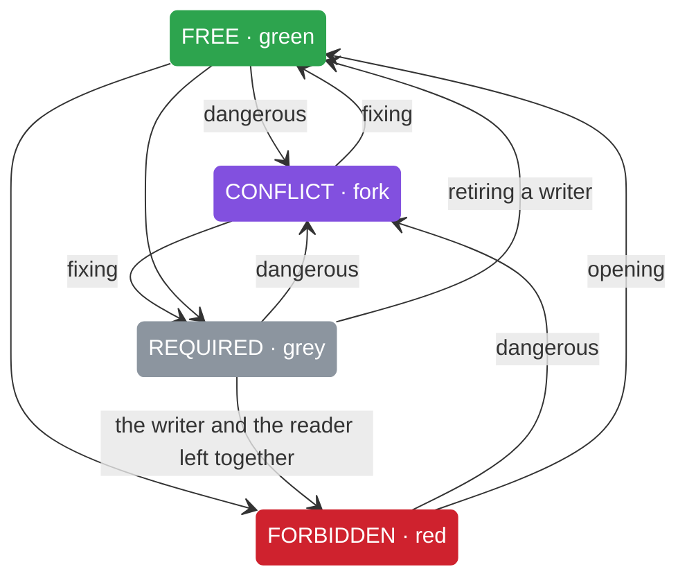
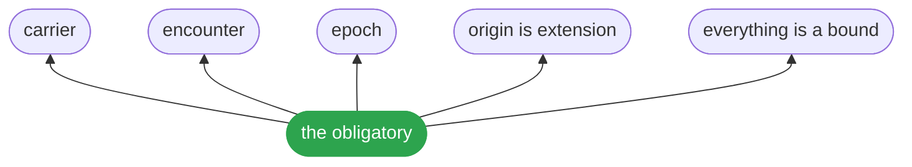

# Reference

Every operation this package offers, every law it states and every form it declares: 185 operations, 109 laws, 5 forms.

## Notation

```text
c = ⟨⊥, ⊤, O, r, ⊑⟩        ⊥, ⊤ ∈ L with ≤     O = {(o, φ, s)}     r ∈ ℕ     ⊑ the order of rest
```

| formula | law | sentence |
|---|---|---|
| `meet(c) = ⊤ ∧ ⋀_{o∈O} span_o` | meet | two bounds on one cell fold by the meet of their form; the order they arrive in never decides |
| `info(c) ⟺ \|ext(O)\| ≥ 2 ∧ meet(c) ≠ ∅` | encounter | a claim from one origin is potential; a cell is information only where two independent origins touch it and their intervals meet |
| `state(c) ∈ {FREE, REQUIRED, FORBIDDEN, CONFLICT}` | four states | one origin is required; two or more that meet within the ceiling are free; that meet outside it are forbidden; that do not meet are in conflict; fewer states collapse two of them |
| `x ⊨ c ⟺ ⊥ ⊑ x ⊑ ⊤` | carrier | every quantity has two poles, a floor that is required and a ceiling that is permitted, and a cell is the pair |
| `F(c) = log₂ \|{x ∈ L : ⊥ ≤ x ≤ ⊤}\|` | debit in bits | the debit of a cell is log2 of the states between its floor and ceiling; a closed cell has zero |
| `claim = (o, span, e), e ≺ e′ ⟺ e → e′` | epoch | every claim carries when it holds; order is causal, never a clock |
| `ext(o) = {(x, span_o(x))}, ext(o) = ext(o′) ⟹ o = o′` | origin is extension | an origin is the set of (coordinate, interval) it has produced; two origins with one extension are one; independence is distance between extensions |
| `o ⊢_{r,e} c for o, c ∈ C, and ⊢ ∈ C` | everything is a bound | one relation: an origin bounds a cell at a resolution and an epoch; cells, origins, locks and laws are cells under it; the relation bounds itself, and there is no level above it |
| `sign: ⊤(c′) ← ⊤(c′) ∧ s ∀ c′ ⊒ c` | signatures are meets | a signature narrows a ceiling and travels to every cell that rests on it as a meet, and meets do not remember the order they were taken in, so no order of any number of signatures ever shows in the field they leave; widening is not a meet and does not travel, which is why a narrowing costs one signature and an error costs one at every cell, and folding the field and signing it commute even with a withdrawal present |
| `join: ⊤(c) ← ⊤(c) ∨ s for c alone, witnessed` | the obligatory | a cell is two poles on a lattice it is given and never one it assumes, a set of origins whose claims say who and when, where a withdrawal names the claim it takes back rather than a value that looks like it, and an order of rest against bounds the cell does not own; six operations answer for it and there are no others: meet, what its origins and the bounds it rests on hold together in that lattice; join, one cell's ceiling widened and no other's, which lands only with a witness; encounter, how many origins met; observe, one more claim; sign, a bound narrowed so every cell resting on it reads the narrower one while no claim is touched; refine, the same cell read at another resolution |

```text
meet      : L × c × bounds → span
encounter : L × c × bounds → {origins, held}
observe   : c × claim → c
sign      : L × bounds × name × span → bounds
join      : L × c × span × witness → c
refine    : c × steps → c
state(c) ∈ {FREE, REQUIRED, FORBIDDEN, CONFLICT}
```

## States



## What the object rests on



## Operations

| operation | view | signature | refuses | law |
|---|---|---|---|---|
| anyOf | chain | `anyOf(c: Scale, units: readonly Unit[]): Unit[]` | 1 | no law |
| coarsen | chain | `coarsen(place: Point, steps: number): Point` | 1 | no law |
| composeState | chain | `composeState(c: Scale, units: readonly Unit[]): State` | 1 | no law |
| conflictDebits | chain | `conflictDebits(c: Scale, u: Unit): number` | 1 | no law |
| downset | chain | `downset(c: Scale, names: readonly string[]): readonly string[]` | 2 | D2-ideal |
| entails | chain | `entails(c: Scale, a: Unit, b: Unit): boolean` | 1 | no law |
| foldRegion | chain | `foldRegion<T>(places: readonly Point[], where: Region, f: (met: readonly Point[])` | 1 | no law |
| freedom | chain | `freedom(c: Scale, u: Unit): number` | 1 | no law |
| missing | chain | `missing( c: Scale, have: Unit, want: Unit, ):` | 2 | no law |
| size | chain | `size(at: readonly string[], steps?: number): number` | 1 | A3-resolution |
| sufficientResolution | chain | `sufficientResolution<T>(finest: number, verdict: (steps: number)` | 1 | T7-sufficient-resolution |
| unit | chain | `unit(subject: string, bounds:` | 1 | D4-debit-in-bits |
| unitToIdeal | chain | `unitToIdeal(c: Scale, u: Unit): IdealDebit` | 2 | no law |
| upset | chain | `upset(c: Scale, names: readonly string[]): readonly string[]` | 2 | D2-ideal |
| weakest | chain | `weakest(methods: Iterable<Method>): Method` | 2 | D4-debit-in-bits |
| and | complement | `and = (a: Packed, b: Packed): Packed` | 8 | no law |
| asBoolean | complement | `asBoolean(c: Scale, u: Unit): BoolView` | 1 | no law |
| bitLoss | complement | `bitLoss(c: Scale):` | 1 | no law |
| canonical | complement | `canonical(pk: Packer, p: Packed): Packed` | 2 | T8-exact-withdrawal |
| opinion | complement | `opinion = ( demanded: number, permitted: number, limiting: number, required: number, ): Packed` | 2 | T8-exact-withdrawal |
| amplitude | field | `amplitude(claim: Claim): number` | 2 | T49-amplitude-has-sign-and-phase |
| budget | field | `budget(cells: number, resolution: number): number` | 2 | H5-hilbert-is-the-obligatory-without-four-fields |
| cell | field | `cell<T>(at: string, epoch = 0, seen: readonly Claim<T>` | 5 | D11-the-obligatory |
| choose | field | `choose(lattice: Lattice<Band>, world: readonly Obligatory<Band>[], weights: Weights, held: ReadonlySet<string>): string` | 2 | T55-a-policy-is-four-weights |
| coherence | field | `coherence(claims: readonly Claim[], period: number): number` | 2 | T49-amplitude-has-sign-and-phase |
| contracts | field | `contracts(regions: readonly Region[], touched: readonly Point[]): boolean` | 1 | no law |
| converge | field | `converge(width: number, maturation: number, forgetting: number, epochs: number):` | 1 | T6-present-converges |
| coordinate | field | `coordinate(name: string, steps = '/'): readonly string[] { const at = name.split(new RegExp(`[${steps.replace(/[.*+?^${}()\|[\]\\-]/g, '\\$&')}]`)).filter((s)` | 12 | D0-coordinate |
| covers | field | `covers(met: readonly Point[], of:` | 1 | no law |
| decohere | field | `decohere(claims: readonly Claim<Band>[], environment: number, period: number): number` | 2 | H5-hilbert-is-the-obligatory-without-four-fields |
| disagree | field | `disagree(place: Point): readonly [Sighting, Sighting] \| null` | 1 | no law |
| distinct | field | `distinct(lattice: Lattice<Band>, world: readonly Obligatory<Band>[], width: number): number` | 2 | H5-hilbert-is-the-obligatory-without-four-fields |
| disturbance | field | `disturbance(lattice: Lattice<Band>, one: Obligatory<Band>, claim: Claim<Band>): number` | 2 | T47-a-two-pole-object |
| encounter | field | `encounter<T>(lattice: Lattice<T>, one: Obligatory<T>, bounds?: ReadonlyMap<string, T>):` | 3 | D11-the-obligatory |
| endsBeforeNow | field | `endsBeforeNow(now: number, leading: readonly (readonly [number, number])[], lagging: readonly (readonly [number, number])[]): boolean` | 1 | D8-present |
| evolve | field | `evolve(world: readonly Obligatory<Band>[], epochs: number, budget_: number, seed: number): readonly (readonly Obligatory<Band>[])[]` | 2 | T52-directing-where-origins-land-closes-the-horizon |
| exclusive | field | `exclusive(mine: readonly Region[], others: readonly (readonly Region[])[]): readonly Region[]` | 1 | no law |
| foldIn | field | `foldIn<T>(L: MeetSemilattice<T>, demands: readonly T[]): T` | 2 | A4-epoch |
| fringes | field | `fringes(claims: readonly Claim[], period: number, delays: readonly number[]): readonly number[]` | 2 | T48-epoch-is-phase |
| interfere | field | `interfere(claims: readonly Claim[], period: number): number` | 2 | T49-amplitude-has-sign-and-phase |
| join | field | `join<T>(lattice: Lattice<T>, one: Obligatory<T>, span: T, witness: string): Obligatory<T>` | 5 | D11-the-obligatory, A7-freedom-conserved |
| key | field | `key(regions: readonly Region[]): string` | 1 | no law |
| latest | field | `latest(places: readonly Point[]): Point \| null` | 1 | no law |
| meet | field | `meet<T>(lattice: Lattice<T>, one: Obligatory<T>, bounds: ReadonlyMap<string, T> = new Map()): T { const rested = one.restsOn.flatMap((name)` | 4 | D11-the-obligatory |
| meetAt | field | `meetAt(place: Point): Interval` | 1 | no law |
| observe | field | `observe<T>(one: Obligatory<T>, claim: Claim<T>): Obligatory<T>` | 3 | D11-the-obligatory |
| origins | field | `origins(place: Point): number` | 16 | no law |
| passes | field | `passes(place: Point \| Region, step: string): boolean` | 1 | no law |
| phase | field | `phase(claim: Claim, period: number): number` | 2 | T48-epoch-is-phase |
| play | field | `play(lattice: Lattice<Band>, world: readonly Obligatory<Band>[], weights: Weights, epochs: number, seed: number, spread: number):` | 2 | T55-a-policy-is-four-weights |
| point | field | `point(name: string, epoch = 0, seen: readonly Sighting[] = [], steps = '/'): Point { return { at: coordinate(name, steps), epoch, seen }; } export function region(name: string, steps = '/'): Region { return { at: coordinate(name, steps) }; } export function coarsen(place: Point, steps: number): Point { return { at: place.at.slice(0, Math.max(0, steps)), epoch: place.epoch, seen: place.seen }; } export function passes(place: Point \| Region, step: string): boolean { return step.startsWith('*') ? place.at.some((s)` | 2 | A1-encounter |
| potential | field | `potential(place: Point): boolean` | 1 | no law |
| present | field | `present(place: Point): Interval \| 'potential' \| null` | 1 | no law |
| refine | field | `refine<T>(one: Obligatory<T>, steps: number): Obligatory<T>` | 2 | D11-the-obligatory |
| region | field | `region(name: string, steps = '/'): Region { return { at: coordinate(name, steps) }; } export function coarsen(place: Point, steps: number): Point { return { at: place.at.slice(0, Math.max(0, steps)), epoch: place.epoch, seen: place.seen }; } export function passes(place: Point \| Region, step: string): boolean { return step.startsWith('*') ? place.at.some((s)` | 2 | D1-region |
| resolution | field | `resolution(place: Point \| Region): number` | 8 | no law |
| sameObject | field | `sameObject(lattice: Lattice<Band>, a: Obligatory<Band>, b: Obligatory<Band>, width: number): boolean` | 2 | H5-hilbert-is-the-obligatory-without-four-fields |
| seenAs | field | `seenAs = (cell: Point, period: number): readonly Claim[]` | 2 | T49-amplitude-has-sign-and-phase |
| selfFold | field | `selfFold(lattice: Lattice<Band>, one: Obligatory<Band>, epochs: number, width: number, spread: number, seed: number): readonly Obligatory<Band>[]` | 2 | T73-a-cell-that-folds-itself-converges |
| sign | field | `sign<T>(lattice: Lattice<T>, bounds: ReadonlyMap<string, T>, name: string, span: T): ReadonlyMap<string, T>; export function sign<T>(lattice: Lattice<T>, world: readonly Obligatory<T>[], name: string, span: T): readonly Obligatory<T>[]; export function sign<T>(lattice: Lattice<T>, held: ReadonlyMap<string, T> \| readonly Obligatory<T>[], name: string, span: T): ReadonlyMap<string, T> \| readonly Obligatory<T>[]` | 3 | D11-the-obligatory |
| turned | field | `turned(before: readonly Point[], after: readonly Point[]): readonly Point[]` | 1 | no law |
| within | field | `within(inner: Point \| Region, outer: Region): boolean` | 2 | D1-region |
| witnessesIn | field | `witnessesIn<T>(L: MeetSemilattice<T>, demands: readonly T[]): readonly [T, T] \| null` | 1 | no law |
| alphabets | galois | `alphabets(): Poset<Alphabet>` | 1 | no law |
| relate | galois | `relate<T>(L: Poset<T>, a: T, b: T): Relation` | 2 | no law |
| closureViolationsIn | ideal | `closureViolationsIn( c: Scale, xs: readonly IdealDebit[], ): readonly string[]` | 1 | no law |
| complexity | ideal | `complexity(c: Scale, u: Unit): number` | 1 | no law |
| dangerous | ideal | `dangerous(m: Matrix): readonly` | 2 | no law |
| fromIdeals | ideal | `fromIdeals(c: Scale): Lattice<IdealDebit>` | 1 | no law |
| holds | ideal | `holds(c: Scale, units: readonly Unit[], index: number): boolean` | 1 | no law |
| idealComplexity | ideal | `idealComplexity(c: Scale, d: IdealDebit): number` | 1 | no law |
| idealDebit | ideal | `idealDebit( c: Scale, demand: readonly string[], permit: readonly string[], ): IdealDebit` | 1 | no law |
| idealEntails | ideal | `idealEntails(a: IdealDebit, b: IdealDebit): boolean` | 1 | no law |
| idealJoin | ideal | `idealJoin(a: IdealDebit, b: IdealDebit): IdealDebit` | 1 | no law |
| idealMeet | ideal | `idealMeet(a: IdealDebit, b: IdealDebit): IdealDebit` | 1 | no law |
| isDistributive | ideal | `isDistributive(c: Scale): boolean` | 1 | no law |
| isDownset | ideal | `isDownset(c: Scale, names: readonly string[]): boolean` | 1 | no law |
| isIdealPair | ideal | `isIdealPair(c: Scale, d: IdealDebit): boolean` | 1 | no law |
| isUpset | ideal | `isUpset(c: Scale, names: readonly string[]): boolean` | 1 | no law |
| moved | ideal | `moved(m: Matrix): number` | 2 | no law |
| packer | ideal | `packer(c: Scale): Packer` | 1 | no law |
| permitAll | ideal | `permitAll = (c: Scale, subject: string): Unit` | 1 | no law |
| quadrants | ideal | `quadrants(demanded: WideMask, permitted: WideMask, extent: WideMask): Quadrants` | 2 | D3-state |
| rebuild | ideal | `rebuild(c: Scale, reg: Register, subject` | 1 | no law |
| register | ideal | `register(c: Scale, u: Unit): Register` | 1 | no law |
| runQuadrants | ideal | `runQuadrants( demanded: readonly Span[], permitted: Span \| null, extent: Span, ): readonly Run[]` | 2 | D3-state |
| state | ideal | `state(c: Scale, u: Unit): State` | 5 | D3-state, D2-ideal |
| stateAt | ideal | `stateAt(q: Quadrants, bit: number): State \| null` | 2 | no law |
| statesPerDebit | ideal | `statesPerDebit(c: Scale, u: Unit): [string, State][]` | 1 | no law |
| table | ideal | `table(a: State, b: State): DebitOutcome` | 1 | no law |
| touches | ideal | `touches(c: Scale, mine: Unit, folded: Unit): boolean` | 1 | no law |
| transitions | ideal | `transitions(before: Quadrants, after: Quadrants, width: number): Matrix` | 2 | no law |
| unitComplexity | ideal | `unitComplexity(c: Scale, u: Unit): number` | 1 | no law |
| widen | ideal | `widen(c: Scale, units: readonly Unit[]): Unit` | 1 | no law |
| alphabetForm | lattice | `alphabetForm: Form<WideMask> = form({ id: 'alphabet', lattice(params) { return subsets(strings(rec(params).tokens)); }, parse(params, demand) { const tokens = strings(rec(params).tokens); const d = rec(demand); const want = d.want !== undefined ? strings(d.want) : tokens; return WideMask.fromTokens(tokens, new Set(want)); }, emit(params, value) { return { want: value.members(strings(rec(params).tokens)) }; }, count(folded) { return { kind: 'finite', n: folded.size() }; }, show(value) { return `${value.size()}`; }, points(params, seed, n) { const tokens = strings(rec(params).tokens); const draw = drawn(seed); return Array.from({ length: n }, ()` | 1 | A2-meet |
| foldSigned | lattice | `foldSigned<T>(L: Poset<T>, values: readonly T[]):` | 2 | D7-fork |
| latticeForm | lattice | `latticeForm: Form<Unit> = form({ id: 'lattice', lattice(params) { const p = rec(params); const levels = strings(p.levels); const leq = p.leq; if (levels.length && leq) return fromScale(order(levels, leq as boolean[][])); throw new Error('lattice needs levels+leq'); }, ...BAND, show(value) { return `${value.floor}..${value.ceiling}`; }, }); export const FORM_IMPLEMENTATIONS: ReadonlyArray<Form>` | 1 | no law |
| meetViolationsIn | lattice | `meetViolationsIn<T>(L: MeetSemilattice<T>, xs: readonly T[]): readonly string[]` | 1 | no law |
| posetViolationsIn | lattice | `posetViolationsIn<T>(L: Poset<T>, xs: readonly T[]): readonly string[]` | 1 | no law |
| replay | lattice | `replay<T>(landed: readonly Point[], where: Region, verdict: (met: readonly Point[])` | 1 | no law |
| subsets | lattice | `subsets(tokens: readonly string[]): Lattice<WideMask>` | 1 | no law |
| violationsIn | lattice | `violationsIn<T>(L: Lattice<T>, xs: readonly T[]): readonly string[]` | 1 | no law |
| agreements | product | `agreements(cells: readonly Point[], steps: number):` | 2 | T36-agreement-has-a-resolution |
| apart | product | `apart = (world: readonly Obligatory<Band>` | 2 | T51-the-shape-of-knowing-can-be-designed |
| area | product | `area(cell: Point): number` | 2 | T38-origins-are-a-polygon |
| buildGraph | product | `buildGraph(edges: readonly Edge[]): Graph` | 2 | T4-composition |
| centre | product | `centre(cell: Point): Vertex` | 3 | T38-origins-are-a-polygon |
| compose | product | `compose(c: Scale, units: readonly Unit[]): Unit` | 2 | no law |
| continuousForm | product | `continuousForm: Form<` | 1 | A2-meet |
| curvature | product | `curvature(world: readonly Point[]): number` | 2 | T40-cost-by-density |
| density | product | `density(cell: Point): number` | 3 | T38-origins-are-a-polygon |
| design | product | `design(world: readonly Obligatory<Band>[], budget: number, bounds: readonly string[] = []): readonly (readonly [string, string])[] { const parts = [...components(world, bounds)].sort((a, b)` | 2 | T51-the-shape-of-knowing-can-be-designed |
| distance | product | `distance(world: readonly Point[], from: string, to: string, bounds: readonly string[] = []): number { if (from === to) return 0; const next = neighbours(world, bounds); const seen = new Set([from]); let edge = [from]; for (let step = 1; edge.length; step += 1) { const further: string[] = []; for (const one of edge) { for (const other of next.get(one) ?? []) { if (seen.has(other)) continue; if (other === to) return step; seen.add(other); further.push(other); } } edge = further; } return world.length; } export function horizon(world: readonly Point[], from: string, bounds: readonly string[] = []): readonly string[] { const next = neighbours(world, bounds); const seen = new Set([from]); const edge = [from]; while (edge.length) { const one = edge.pop()!; for (const other of next.get(one) ?? []) if (!seen.has(other)) { seen.add(other); edge.push(other); } } return world.map(at).filter((place)` | 3 | T41-distance-is-the-walk-between-lookings |
| entangled | product | `entangled(world: readonly Point[], bound: string): readonly string[]` | 3 | T45-cells-that-rest-on-one-bound-are-entangled |
| fromScale | product | `fromScale(c: Scale): Lattice<Unit>` | 1 | no law |
| fuse | product | `fuse(c: Scale, units: readonly Unit[]): Unit` | 1 | no law |
| grow | product | `grow(walls: readonly number[], placed: readonly number[]): readonly` | 2 | T39-cells-grow-until-stopped |
| horizon | product | `horizon(world: readonly Point[], from: string, bounds: readonly string[] = []): readonly string[] { const next = neighbours(world, bounds); const seen = new Set([from]); const edge = [from]; while (edge.length) { const one = edge.pop()!; for (const other of next.get(one) ?? []) if (!seen.has(other)) { seen.add(other); edge.push(other); } } return world.map(at).filter((place)` | 2 | T41-distance-is-the-walk-between-lookings |
| horizonTotal | product | `horizonTotal(world: readonly Obligatory<Band>[], bounds: readonly string[] = []): number { const sizes = components(world, bounds).map((part)` | 2 | T51-the-shape-of-knowing-can-be-designed |
| hull | product | `hull(cell: Point): readonly Vertex[]` | 2 | T38-origins-are-a-polygon |
| intervals | product | `intervals(lo: number, hi: number): Lattice<Interval>` | 1 | no law |
| ladderForm | product | `ladderForm: Form<Unit> = form({ id: 'ladder', lattice(params) { const levels = strings(rec(params).levels); if (levels.length === 0) throw new Error('ladder needs levels'); return fromScale(chain(levels)); }, ...BAND, show(value) { return value.floor === value.ceiling ? value.floor : `${value.floor}..${value.ceiling}`; }, }); export const alphabetForm: Form<WideMask>` | 1 | A2-meet |
| lone | product | `lone = (name: string, epoch = 0): Obligatory<Band>` | 2 | T44-an-origin-is-worth-its-reach |
| loom | product | `loom(world: readonly Obligatory<Band>[], epochs: number, budget: number, bounds: readonly string[] = []): readonly number[] { let held = world; const out: number[] = [horizonTotal(held, bounds)]; for (let epoch = 1; epoch <= epochs; epoch += 1) { held = landed(held, design(held, budget, bounds), epoch); out.push(horizonTotal(held, bounds)); } return out; } export const apart = (world: readonly Obligatory<Band>` | 2 | T52-directing-where-origins-land-closes-the-horizon |
| neighbours | product | `neighbours(world: readonly Point[], bounds: readonly string[] = []): ReadonlyMap<string, readonly string[]>` | 2 | T41-distance-is-the-walk-between-lookings |
| or | product | `or = (a: Packed, b: Packed): Packed` | 4 | no law |
| outliers | product | `outliers(cell: Point): readonly string[]` | 3 | T38-origins-are-a-polygon |
| pour | product | `pour(world: readonly Point[], lock: Lock):` | 2 | T37-a-lock-is-a-mould |
| rank | product | `rank(world: readonly Obligatory<Band>[], bound: string): number` | 2 | T45-cells-that-rest-on-one-bound-are-entangled |
| reach | product | `reach(world: readonly Point[], from: string, bounds: readonly string[] = []): number { return world.length - horizon(world, from, bounds).length - 1; } export function tunnel(world: readonly Point[], places: readonly string[], bounds: readonly string[] = []): readonly (readonly [string, string])[] { const crossed: [string, string][] = []; for (const a of places) for (const b of places) if (a < b && distance(world, a, b, bounds) >` | 3 | T46-a-bound-moves-cells-no-walk-reaches |
| reachIds | product | `reachIds(g: Graph, from: number, scratch?: Uint8Array): Uint8Array` | 2 | T4-composition |
| red | product | `red(world: readonly Point[], lock: Lock): readonly string[]` | 2 | T37-a-lock-is-a-mould |
| residual | product | `residual(cells: readonly Point[], steps: number): number` | 2 | T36-agreement-has-a-resolution |
| resting | product | `resting(world: readonly Point[], bound: string, was: Interval, now: Interval): readonly string[]` | 3 | T45-cells-that-rest-on-one-bound-are-entangled |
| sited | product | `sited = (world: readonly Obligatory<Band>` | 2 | T51-the-shape-of-knowing-can-be-designed |
| steady | product | `steady(cell: Point): boolean` | 3 | T38-origins-are-a-polygon |
| stretch | product | `stretch(lock: Lock, k: number): Lock` | 2 | T37-a-lock-is-a-mould |
| sufficient | product | `sufficient(cells: readonly Point[], upTo: number, tolerance` | 2 | T36-agreement-has-a-resolution |
| tense | product | `tense(lock: Lock, world: readonly Point[], rate: number): Lock` | 2 | T37-a-lock-is-a-mould |
| tighter | product | `tighter(before: Lock, after: Lock):` | 2 | T37-a-lock-is-a-mould |
| tunnel | product | `tunnel(world: readonly Point[], places: readonly string[], bounds: readonly string[] = []): readonly (readonly [string, string])[] { const crossed: [string, string][] = []; for (const a of places) for (const b of places) if (a < b && distance(world, a, b, bounds) >` | 2 | T44-an-origin-is-worth-its-reach |
| vertices | product | `vertices(cell: Point): readonly Vertex[]` | 2 | T38-origins-are-a-polygon |
| width | product | `width(cell: Point): number` | 3 | T38-origins-are-a-polygon |
| answers | quotient | `answers(met: readonly Point[], where: readonly Region[]): boolean` | 1 | no law |
| outranks | quotient | `outranks(met: readonly Point[], named: readonly (readonly [string, string])[], order: readonly string[]): string \| null` | 1 | no law |
| permutationBlind | quotient | `permutationBlind<T, R>( values: readonly T[], claim: (xs: readonly T[])` | 1 | A2-meet |
| permute | quotient | `permute<T>(xs: readonly T[], salt: number): T[]` | 1 | A2-meet |
| retracted | quotient | `retracted(met: readonly Point[], by: readonly Region[]): readonly Point[]` | 1 | no law |
| verified | quotient | `verified(met: readonly Point[], green: (place: Point)` | 1 | no law |
| attainable | spectrum | `attainable(c: Scale):` | 1 | no law |
| c_n | spectrum | `c_n(n: number): number` | 1 | T13-c_n |
| classifyValue | spectrum | `classifyValue(c: Scale, value: string): Attainability` | 1 | no law |
| meetBlocks | spectrum | `meetBlocks(c: Scale, u: Level, w: Level): Level[][]` | 1 | no law |
| spectrum | spectrum | `spectrum( c: Scale, worth: Valuation, places = 9, quantity: SpectrumQuantity = 'premium', ): { values: number[]; pairs: number; band: { low: number; high: number }; degeneracy: number } { const seen = new Set<number>` | 1 | no law |
| asUnit | valuation | `asUnit(c: Scale, d: Declaration, subject` | 2 | no law |
| best | valuation | `best: Search = (c, value, u, w)` | 1 | thm-extremal |
| chain | valuation | `chain(levels: readonly string[]): Scale` | 5 | no law |
| collapses | valuation | `collapses(c: Scale, value: Valuation, u: Level, w: Level, tol` | 1 | no law |
| conj | valuation | `conj(c: Scale, a: Declaration, b: Declaration): Declaration` | 2 | no law |
| costOfState | valuation | `costOfState( c: Scale, value: Valuation, u: Level, w: Level, s: Level, ):` | 1 | no law |
| declaration | valuation | `declaration(c: Scale, u: Unit): Declaration` | 2 | D5-declaration |
| declarationOf | valuation | `declarationOf(c: Scale, place: Point):` | 1 | no law |
| defect | valuation | `defect(c: Scale, value: Valuation, a: Level, b: Level): number` | 1 | no law |
| degenerate | valuation | `degenerate(c: Scale, value: (level: Level)` | 1 | no law |
| disj | valuation | `disj(c: Scale, a: Declaration, b: Declaration): Declaration` | 2 | no law |
| dropTo | valuation | `dropTo = (value: Valuation, u: Level, m: Level): number` | 1 | no law |
| frontier | valuation | `frontier(c: Scale, value: (level: Level)` | 2 | D10-open-question |
| gap | valuation | `gap(c: Scale, value: Valuation, u: Level, w: Level): number` | 1 | no law |
| height | valuation | `height(c: Scale, level: Level): number` | 1 | no law |
| isMonotone | valuation | `isMonotone(c: Scale, value: Valuation): boolean` | 1 | no law |
| isSupermodular | valuation | `isSupermodular(c: Scale, value: Valuation): boolean` | 1 | no law |
| movesOf | valuation | `movesOf(c: Scale, before: Point, after: Point): Matrix` | 1 | no law |
| order | valuation | `order(levels: readonly string[], leq: readonly boolean[][]): Scale` | 1 | no law |
| premium | valuation | `premium(c: Scale, value: Valuation, u: Level, w: Level): number` | 2 | D6-premium |
| premiumOf | valuation | `premiumOf(c: Scale, value: (level: Level)` | 1 | no law |
| price | valuation | `price(c: Scale, value: Valuation, u: Level, w: Level): Price` | 1 | no law |
| pricesAnything | valuation | `pricesAnything(c: Scale, worth: Valuation): boolean` | 1 | no law |
| registerOf | valuation | `registerOf(c: Scale, place: Point): readonly [string, State][]` | 1 | no law |
| slack | valuation | `slack(c: Scale, a: Level, b: Level):` | 1 | no law |
| stateOf | valuation | `stateOf(c: Scale, place: Point): State` | 1 | no law |
| unitOf | valuation | `unitOf(c: Scale, place: Point): Unit` | 1 | no law |
| unitStream | valuation | `unitStream(seed: number): ()` | 1 | no law |
| vacuityOf | valuation | `vacuityOf( predicate: string, structure: string, c: Scale, test: (c: Scale, value: Valuation)` | 1 | no law |
| withdrawsExactly | valuation | `withdrawsExactly(c: Scale): boolean` | 1 | no law |
| yieldOf | valuation | `yieldOf(c: Scale, acts: readonly Act[]): readonly Yield[]` | 2 | D9-yield |

## Laws

| law | kind | view | rests on | sentence | formula | yes | falsifier | reproduced |
|---|---|---|---|---|---|---|---|---|
| A0-carrier | axiom | lattice | nothing | every quantity has two poles, a floor that is required and a ceiling that is permitted, and a cell is the pair | `x ⊨ c ⟺ ⊥ ⊑ x ⊑ ⊤` | [yes](../samples/yes/A0-carrier.json) | derived by the reader | not a derivation |
| A1-encounter | axiom | field | nothing | a claim from one origin is potential; a cell is information only where two independent origins touch it and their intervals meet | `info(c) ⟺ \|ext(O)\| ≥ 2 ∧ meet(c) ≠ ∅` | [yes](../samples/yes/A1-encounter.json) | derived by the reader | not a derivation |
| A2-meet | axiom | lattice | nothing | two bounds on one cell fold by the meet of their form; the order they arrive in never decides | `meet(c) = ⊤ ∧ ⋀_{o∈O} span_o` | [yes](../samples/yes/A2-meet.json) | derived by the reader | not a derivation |
| A3-resolution | axiom | chain | nothing | every observation has a scale; hierarchy is resolution; a coordinate's depth is its resolution |  | [yes](../samples/yes/A3-resolution.json) | derived by the reader | not a derivation |
| A4-epoch | axiom | field | nothing | every claim carries when it holds; order is causal, never a clock | `claim = (o, span, e), e ≺ e′ ⟺ e → e′` | [yes](../samples/yes/A4-epoch.json) | derived by the reader | not a derivation |
| A5-origin-is-extension | axiom | galois | nothing | an origin is the set of (coordinate, interval) it has produced; two origins with one extension are one; independence is distance between extensions | `ext(o) = {(x, span_o(x))}, ext(o) = ext(o′) ⟹ o = o′` | [yes](../samples/yes/A5-origin-is-extension.json) | derived by the reader | not a derivation |
| A6-vacuity | axiom | field | nothing | a region no origin touches for an epoch contracts; nothing keeps a cell alive but a new observation |  | [yes](../samples/yes/A6-vacuity.json) | derived by the reader | not a derivation |
| A7-freedom-conserved | axiom | chain | nothing | the freedom of a system is the sum of its cells' debits in bits; an encounter never raises it; only a new coordinate does |  | [yes](../samples/yes/A7-freedom-conserved.json) | derived by the reader | not a derivation |
| A8-four-states | axiom | ideal | nothing | one origin is required; two or more that meet within the ceiling are free; that meet outside it are forbidden; that do not meet are in conflict; fewer states collapse two of them | `state(c) ∈ {FREE, REQUIRED, FORBIDDEN, CONFLICT}` | [yes](../samples/yes/A8-four-states.json) | derived by the reader | not a derivation |
| A9-everything-is-a-bound | axiom | lattice | nothing | one relation: an origin bounds a cell at a resolution and an epoch; cells, origins, locks and laws are cells under it; the relation bounds itself, and there is no level above it | `o ⊢_{r,e} c for o, c ∈ C, and ⊢ ∈ C` | [yes](../samples/yes/A9-everything-is-a-bound.json) | derived by the reader | not a derivation |
| C1-independence-is-distance | corollary | galois | A5-origin-is-extension | the independence of two origins is the distance between their extensions: one extension is one origin, disjoint extensions share nothing |  | [yes](../samples/yes/C1-independence-is-distance.json) | derived by the reader | yes |
| C3-bootstrap-once | corollary | field | A1-encounter, A4-epoch | one claim per generation is admitted without a second origin; a second such claim is a fork |  | [yes](../samples/yes/C3-bootstrap-once.json) | derived by the reader | yes |
| C4-dpi-subadditive | corollary | valuation | thm-collapse, thm-modular | Data processing forces submodularity — Every valuation with the data-processing property is submodular. Among such valuations, $g\equiv0$ if and only if $f$ is modular. |  | none | derived by the reader | yes |
| D0-coordinate | definition | field | A1-encounter | a coordinate exists where two origins agree they observe one thing; the coordinate set of a domain is the fold of recognitions, never a schema |  | [yes](../samples/yes/D0-coordinate.json) | derived by the reader | not a derivation |
| D1-region | definition | field | A3-resolution | a region is (coordinate prefix, length); refinement is a longer prefix; regions are derived, never stored |  | none | derived by the reader | not a derivation |
| D10-open-question | definition | valuation | A0-carrier, A1-encounter, D6-premium | a signed ceiling with no origin: a question with form, resolution, premium, dependents and a cheapest closer |  | [yes](../samples/yes/D10-open-question.json) | derived by the reader | not a derivation |
| D11-the-obligatory | definition | lattice | A0-carrier, A1-encounter, A4-epoch, A5-origin-is-extension, A9-everything-is-a-bound | a cell is two poles on a lattice it is given and never one it assumes, a set of origins whose claims say who and when, where a withdrawal names the claim it takes back rather than a value that looks like it, and an order of rest against bounds the cell does not own; six operations answer for it and there are no others: meet, what its origins and the bounds it rests on hold together in that lattice; join, one cell's ceiling widened and no other's, which lands only with a witness; encounter, how many origins met; observe, one more claim; sign, a bound narrowed so every cell resting on it reads the narrower one while no claim is touched; refine, the same cell read at another resolution | `join: ⊤(c) ← ⊤(c) ∨ s for c alone, witnessed` | none | derived by the reader | not a derivation |
| D2-ideal | definition | ideal | A0-carrier | a cell's bound is an ideal (upset, downset): what is required and what is forbidden, as a pair |  | none | derived by the reader | not a derivation |
| D3-state | definition | ideal | D2-ideal | a cell is in one of four states: FREE, REQUIRED, FORBIDDEN, CONFLICT — green, grey, red, fork are their renders |  | [yes](../samples/yes/D3-state.json) | derived by the reader | not a derivation |
| D4-debit-in-bits | definition | chain | A0-carrier, A3-resolution | the debit of a cell is log2 of the states between its floor and ceiling; a closed cell has zero | `F(c) = log₂ \|{x ∈ L : ⊥ ≤ x ≤ ⊤}\|` | [yes](../samples/yes/D4-debit-in-bits.json) | derived by the reader | not a derivation |
| D5-declaration | definition | valuation | A0-carrier | a declaration is a demand u and a limit w on a valued lattice; its cost is forced by two axioms |  | none | derived by the reader | not a derivation |
| D6-premium | definition | valuation | D5-declaration, D4-debit-in-bits | the premium of a cell is what closing it costs: the residual information under the declaration |  | none | derived by the reader | not a derivation |
| D7-fork | definition | lattice | A2-meet | two incomparable bounds on one cell from two signers; rendered with both, closed only by a signature |  | none | derived by the reader | not a derivation |
| D8-present | definition | field | A4-epoch, A3-resolution | the present is the meet of overlapping observation bands; there is no instant to certify |  | [yes](../samples/yes/D8-present.json) | derived by the reader | not a derivation |
| D9-yield | definition | valuation | A5-origin-is-extension, D4-debit-in-bits | an origin's yield is bits it closed minus bits reopened against it, per act, over an epoch |  | [yes](../samples/yes/D9-yield.json) | derived by the reader | not a derivation |
| H1-uncertainty | conjecture | chain | A3-resolution, A1-encounter | resolution times independent encounters per cell stays above a floor c; the sufficient resolution is where the product saturates |  | [yes](../samples/yes/H1-uncertainty.json) | a cell read at four resolutions whose product of resolution and independent encounters comes out above the floor while the encounters fall away with the sharpening. A product that rises as the reading sharpens would say the floor is not a floor but an accident of how coarsely the cell was read. | not a derivation |
| H2-density-attracts | conjecture | field | A1-encounter, A6-vacuity | where reading already is, the next reading lands: over eight epochs of placement in proportion to the origins a cell already carries, the ratio between the densest tenth and the sparsest rises at every epoch and the deserts stay empty, while the same budget placed blind to density holds that ratio near two and touches three times as many cells |  | [yes](../samples/yes/H2-density-attracts.json) | encounters that land independently of the density already there. Then the ratio does not rise with the epochs and the cells touched grow with the budget, which is what the blind placement in the yes sample shows. | not a derivation |
| H3-a-distant-signature-moves-a-cell-that-did-not-move | conjecture | lattice | T46-a-bound-moves-cells-no-walk-reaches, T47-a-two-pole-object | stated as a hint and never as a claim about the world: if what is is a field of floors and ceilings, a distant signature changes a cell whose own record never moved, and in two hundred trials of one cell holding one value the verdict came out both ways, so nothing stored at the cell explains the difference and what explains it is the bound the cell rests on; the resemblance is structural and never arithmetic, with no continuous amplitudes and no inequality violated by number; structural resemblance, one origin, not a claim about the world |  | [yes](../samples/yes/H3-a-distant-signature-moves-a-cell-that-did-not-move.json) | one act that is both local and non-local — a change that travels a distance and also reaches a cell that does not rest on its bound. The two poles would then be one, and this would be a claim about the world rather than a hint. | not a derivation |
| H4-enriched-semilattice | conjecture | lattice | T50-signatures-are-meets, T49-amplitude-has-sign-and-phase, T41-distance-is-the-walk-between-lookings | the cells under the order of rest, with signatures as meets and the phase each origin carries as what they are enriched over, look like an enriched meet-semilattice, and what this library proves would be its representation theory; identity, composition, associativity, commuting and naturality hold for the operations as vectors, while observation is not one of them — it moves the metric and can split a cell no signature could, so it is a functor out of the category and not an arrow inside it, and the join, which does not travel, is a second kind of arrow this conjecture does not name |  | [yes](../samples/yes/H4-enriched-semilattice.json) | a pair of the five operations whose composition the axioms do not determine. The join is already known to be absent from them: it does not travel, and naming what it is would be a second kind of arrow this conjecture does not have. | not a derivation |
| H5-hilbert-is-the-obligatory-without-four-fields | conjecture | lattice | H3-a-distant-signature-moves-a-cell-that-did-not-move, T49-amplitude-has-sign-and-phase, T36-agreement-has-a-resolution, T45-cells-that-rest-on-one-bound-are-entangled | amplitudes with a phase and no origin, no signed ceiling, no resolution and no epoch band are what is left of a cell when those four fields are dropped, so the measurement problem is the absence of who, imposed symmetries the absence of a signed ceiling, the classical limit the absence of resolution and universal interference the absence of bands; restored, four claims in phase keep exactly the share of the whole their number leaves them against an environment spread over the period, and six origins around one value are six objects read finely and one read coarsely, so how many things there are is a reading; structural resemblance, one origin, not a claim about the world |  | [yes](../samples/yes/H5-hilbert-is-the-obligatory-without-four-fields.json) | a result of the usual formalism that cannot be stated with the four fields, or a prediction the restored fields make that the arithmetic forbids. This conjecture is about which structure is missing, not about numbers the arithmetic already gives. | not a derivation |
| H6-structure-of-measurement | conjecture | lattice | D11-the-obligatory, A0-carrier, A1-encounter, A3-resolution | four instruments that share no mechanism fold the same way because a measurement is a cell: for a thermometer, a survey, an interferometer and a headcount the five fields are named without strain and the same five operations answer for all four; no number is claimed, only that the table can be filled in every row |  | [yes](../samples/yes/H6-structure-of-measurement.json) | an instrument whose reading cannot be written as a floor and a ceiling held by an origin at an epoch and a resolution, without straining any of the five. | not a derivation |
| H7-the-medium-of-encounters | conjecture | field | A1-encounter, T41-distance-is-the-walk-between-lookings, D1-region | what carries an encounter is a medium, and a medium is what two origins can both reach: in each instrument the medium can be named and the encounter happens where two origins touch it and nowhere else, so two origins at one cell make information and the same two at two cells make none; structural resemblance, one origin, not a claim about the world |  | [yes](../samples/yes/H7-the-medium-of-encounters.json) | an encounter between two origins with nothing they both reach. Then information would appear where nothing was shared. | not a derivation |
| H8-refereed-game | conjecture | lattice | T57-a-refereed-game-governs-itself, A1-encounter, T50-signatures-are-meets | a field of cells with origins and signatures is a game whose referee is inside it: a move is a claim, a claim alone is potential, two that meet are information, a signature moves every cell that rests on it, and no player may suspend the rule that makes the first four; the claim is that each of five readings of the field matches all five properties; structural resemblance, one origin, not a claim about the world |  | [yes](../samples/yes/H8-refereed-game.json) | a reading of the field where a player can suspend the rule that two origins are needed, or where one claim is information. Then the referee would be outside the game. | not a derivation |
| H9-the-obligatory-is-maximal | conjecture | lattice | A8-four-states, A9-everything-is-a-bound, D11-the-obligatory | the obligatory is maximal: take away any one of its seven parts and what is left is an object already known, and anything added to it is either already inside it or breaks the four states |  | [yes](../samples/yes/H9-the-obligatory-is-maximal.json) | a part the obligatory lacks that keeps the four states and the six operations and is not a reading of one of them. | not a derivation |
| lem-identity | theorem | spectrum | A0-carrier, A2-meet, D5-declaration | The graph identity — If $x\wedge y=\bot$ then \[ \RI_H(x,y)\;=\;\log_2 n-\frac{\Phi(x,y)}{n}, \qquad \Phi(x,y)=\sum_{e}c_e\log_2\frac{a_e\,b_e}{c_e}, \] the sum running over the edges of $G(x,y)$, where $c_e$ is the weight of $e$ and $a_e,b_e$ are the sizes of the two blocks it joins. |  | [yes](../samples/yes/lem-identity.json) | derived by the reader | yes |
| lem-join | corollary | spectrum | lem-identity | Reduction to a discrete join — Every pair with trivial meet can be transformed, without decreasing $\RI_H$ and in finitely many steps, into a pair on the same $n$ states with trivial meet and discrete join. |  | [yes](../samples/yes/lem-join.json) | derived by the reader | yes |
| lem-mediant | corollary | spectrum | lem-merge | Components, and the mediant — Both $\Sigma(m)-\Sigma(u)$ and $\Sigma(w)-\Sigma(j)$ decompose as sums over the blocks of $m$, which are the connected components of the block graph $G(u,w)$; and a component contributing $0$ to the denominator contributes $0$ to the numerator. Hence the ratio is at most the largest ratio of a single component, each of which is a declaration on $n_t\le n$ states with trivial meet. |  | none | derived by the reader | yes |
| lem-meet | theorem | spectrum | lem-identity, prop-cmi | Reduction to a trivial meet — Let $\tau(N)$ denote the maximum of $\RI_H$ over pairs on $N$ states with trivial meet. Then for any $x,y\in\Pin$ with $x\wedge y$ having blocks of sizes $n_1,\dots,n_r$, \[ \RI_H(x,y)=\sum_{t=1}^{r}\frac{n_t}{n}\,\RI_H\bigl(x\|_{B_t},y\|_{B_t}\bigr) \;\le\;\sum_t \frac{n_t}{n}\,\tau(n_t). \] Each restricted pair has trivial meet. If $\tau$ is non-decreasing the bound is $\tau(n)$; and if $\tau$ is moreover strictly increasing above $N=2$, equality for $n\ge3$ forces $r=1$. |  | [yes](../samples/yes/lem-meet.json) | derived by the reader | yes |
| lem-merge | theorem | spectrum | A0-carrier, A2-meet, D5-declaration | Every coarsening step costs two — For integers $p,q\ge1$, $\varphi(p+q)-\varphi(p)-\varphi(q)\ge2$, with equality exactly at $p=q=1$. Consequently, if $P$ coarsens $Q$ from $\|Q\|$ blocks to $\|P\|$ blocks then $\Sigma(P)-\Sigma(Q)\ge2\bigl(\|Q\|-\|P\|\bigr)$. |  | [yes](../samples/yes/lem-merge.json) | derived by the reader | yes |
| lem-phi | theorem | spectrum | lem-join, lem-meet | The integer inequality — For every integer $t\ge1$, $\varphi(t)\ge 2(t-1)$, with equality exactly at $t\in\{1,2\}$. |  | [yes](../samples/yes/lem-phi.json) | derived by the reader | yes |
| prop-additive | theorem | valuation | D2-ideal, D3-state | What is additive under independence, and what is not — Let $L=L_1\times L_2$ with each factor of at least two elements, and let $f=f_1\oplus f_2$. Then $\viol_f$ and $\viols_f$ are exactly additive on product declarations: two-sided constraints admit no economy of scale under independence. The vocabulary is not: \[ \delta(L_1\times L_2)\;=\;\|L_1\|\|L_2\|-\|MI(L_1)\|-\|MI(L_2)\|, \] which exceeds $\delta(L_1)+\delta(L_2)$ by exactly $(\|L_1\|-1)(\|L_2\|-1)-1$, strictly unless both factors are the two-element lattice. |  | [yes](../samples/yes/prop-additive.json) | derived by the reader | yes |
| prop-cmi | theorem | valuation | A0-carrier, A2-meet, D5-declaration | cf. — $\RI_H(x,y)=I(x;y\mid x\wedge y)$. |  | [yes](../samples/yes/prop-cmi.json) | derived by the reader | yes |
| prop-dep | corollary | valuation | thm-collapse | Both costs, decomposed — For every declaration on $L$, with $u,w,m,j$ as usual and $\viol_i,g_i$ computed from $f_i$ on coordinate $i$, \[ \viol_f \;=\; \viol_1+\viol_2+\bigl[D(u)-D(m)\bigr], \qquad g_f \;=\; g_1+g_2+\RI_D(u,w), \] the second under the data-processing property for $f,f_1,f_2$. |  | [yes](../samples/yes/prop-dep.json) | derived by the reader | yes |
| prop-halfboolean | theorem | complement | D2-ideal, D3-state | Half Boolean — For every finite lattice and every debit $j$, the limit side is truth-functional: $j\le w_1\wedge w_2$ iff $j\le w_1$ and $j\le w_2$. The demand side --- whether $j\le u_1\vee u_2$ is determined by $(j\le u_1,\ j\le u_2)$ --- is truth-functional if and only if $L$ is distributive. |  | none | derived by the reader | yes |
| T1-only-verdict-bits-travel | theorem | chain | D4-debit-in-bits, A2-meet | an origin that moves a verdict carries at least the bits by which it reduces the cell's debit, and exactly those suffice |  | [yes](../samples/yes/T1-only-verdict-bits-travel.json) | derived by the reader | yes |
| T10-drift | corollary | quotient | A5-origin-is-extension | two definitions of one question diverge without either failing; the divergence is invisible until an encounter joins them |  | [yes](../samples/yes/T10-drift.json) | derived by the reader | yes |
| T11-size-is-questions | theorem | quotient | T10-drift, A6-vacuity | the size of a body of knowledge is its count of distinct questions with an encounter; the rest is drift |  | [yes](../samples/yes/T11-size-is-questions.json) | derived by the reader | yes |
| T12-reliability-is-encounter-rate | theorem | valuation | A1-encounter, T10-drift | the fraction of a domain's claims that are facts equals its second-origin rate; drift and surviving falsehood are its complement |  | [yes](../samples/yes/T12-reliability-is-encounter-rate.json) | derived by the reader | yes |
| T13-c_n | corollary | valuation | D6-premium | c_n = log2 n − 2 + 2/n bounds a pairwise audit's conservativeness in bits |  | [yes](../samples/yes/T13-c_n.json) | derived by the reader | yes |
| T14-supermodular-degeneration | theorem | valuation | D6-premium, A1-encounter | premium is zero iff the valuation is supermodular there: a second origin adds nothing |  | none | derived by the reader | yes |
| T15-premium-is-residual-information | theorem | valuation | D6-premium, thm-gap | the premium equals residual information exactly for valuations with the data-processing property |  | none | derived by the reader | yes |
| T16-encounter-inequality | theorem | chain | A1-encounter, D4-debit-in-bits, T14-supermodular-degeneration | an independent second origin never raises a cell's debit: it falls by log2 of the states it leaves standing, a full bit exactly when it admits at most half of them, and nothing exactly when it narrows nothing |  | [yes](../samples/yes/T16-encounter-inequality.json) | a drop of a full bit where the second origin left fifteen of the sixteen states standing. | yes |
| T17-coding-of-verdicts | theorem | chain | T1-only-verdict-bits-travel, D4-debit-in-bits | no claim shorter than the debit reduction moves a verdict; none longer is needed |  | none | derived by the reader | yes |
| T18-freedom-is-a-currency | theorem | valuation | A7-freedom-conserved, D9-yield, A5-origin-is-extension | closed bits with a second origin are scarce, unforgeable, measurable, transferable and third-party verifiable; no issuer exists |  | [yes](../samples/yes/T18-freedom-is-a-currency.json) | derived by the reader | yes |
| T19-signatures-fold | theorem | lattice | A2-meet, D7-fork | two signed bounds on one cell fold by form: narrower wins, equal is an encounter, incomparable is a fork; nothing is ever replaced |  | [yes](../samples/yes/T19-signatures-fold.json) | derived by the reader | yes |
| T2-coordinate-where-disagree | theorem | field | A1-encounter, D0-coordinate | a new coordinate appears exactly where two origins disagree at the same resolution |  | [yes](../samples/yes/T2-coordinate-where-disagree.json) | derived by the reader | yes |
| T20-age-is-encounters | theorem | field | A4-epoch, A1-encounter, D8-present | a region's age is the encounters since its last observation, not elapsed clock; the width of its present is the inverse of its encounter rate |  | [yes](../samples/yes/T20-age-is-encounters.json) | derived by the reader | yes |
| T21-reading-is-an-origin | theorem | galois | A5-origin-is-extension, A1-encounter | a reading is a claim by the reader on the cell at its resolution — a weak encounter; undisputed density is agreement |  | [yes](../samples/yes/T21-reading-is-an-origin.json) | derived by the reader | yes |
| T22-fold-is-superposition | theorem | field | A2-meet, A4-epoch, A1-encounter | two claims fold when their epochs meet and their intervals meet; epochs that meet with intervals that do not are a fork, and epochs that do not meet are no encounter at all |  | [yes](../samples/yes/T22-fold-is-superposition.json) | derived by the reader | yes |
| T23-domain-has-a-spectrum | theorem | field | T22-fold-is-superposition, T20-age-is-encounters, A3-resolution | two origins meet at the common multiple of their periods, so a domain has a spectrum of resolutions where encounters happen; read coarser, a claim recovers the fine cells that lay under it |  | [yes](../samples/yes/T23-domain-has-a-spectrum.json) | derived by the reader | yes |
| T24-ignorance-has-coordinates | theorem | valuation | D10-open-question, A7-freedom-conserved | what is not known has coordinates: the open questions rank by premium against dependents and cost, and a small head of that order holds most of the value |  | [yes](../samples/yes/T24-ignorance-has-coordinates.json) | derived by the reader | yes |
| T25-rules-earn-their-place | theorem | quotient | A6-vacuity, T1-only-verdict-bits-travel, T2-coordinate-where-disagree | counted by mentions, a corpus of rules grows vacuous without bound; counted by the verdicts they move, vacuity converges: a rule earns its place by moving a verdict |  | [yes](../samples/yes/T25-rules-earn-their-place.json) | derived by the reader | yes |
| T26-knowing-has-four-states | theorem | lattice | A9-everything-is-a-bound, A8-four-states, A1-encounter | knowing grows by disagreement: most cells are born where two origins split, and what stays grey is a small remainder |  | [yes](../samples/yes/T26-knowing-has-four-states.json) | derived by the reader | yes |
| T27-disagreement-can-be-provoked | theorem | field | T2-coordinate-where-disagree, A7-freedom-conserved, A5-origin-is-extension | spending a budget where the premium is highest closes more than spending it blindly, and provoking the disagreement closes more still and names coordinates that were not there |  | [yes](../samples/yes/T27-disagreement-can-be-provoked.json) | derived by the reader | yes |
| T3-fixed-point | theorem | product | A2-meet, A1-encounter | two heads folding the same claims converge to one fold; the fixed point is unique |  | none | derived by the reader | yes |
| T36-agreement-has-a-resolution | theorem | chain | A3-resolution, T2-coordinate-where-disagree, T7-sufficient-resolution | n origins on a cell agree at a resolution; raising it opens agreements into forks, each a coordinate the coarser scale hid; the sufficient resolution of a region is where its residual figure stops changing |  | [yes](../samples/yes/T36-agreement-has-a-resolution.json) | derived by the reader | yes |
| T37-a-lock-is-a-mould | theorem | dual | A0-carrier, A6-vacuity, T25-rules-earn-their-place, T36-agreement-has-a-resolution | stretching every ceiling by one factor separates what no width can hold, a cell whose origins do not meet, from a ceiling that was merely tight; pouring another world into a lock counts the places it fills; and a lock deforms with use, what was touched closing toward what was seen there and what was not opening, toward the shape the world gives it |  | [yes](../samples/yes/T37-a-lock-is-a-mould.json) | derived by the reader | yes |
| T38-origins-are-a-polygon | theorem | product | A1-encounter, A2-meet, A5-origin-is-extension, T2-coordinate-where-disagree | n independent origins on a cell are the vertices of a polygon whose interior is their meet: two an edge, three an area, four a vertex the others do not enclose, five a verdict that holds without any one of them, and beyond that a meet that narrows toward consensus — a meet that never closes at any n is two cells wearing one name |  | [yes](../samples/yes/T38-origins-are-a-polygon.json) | derived by the reader | yes |
| T39-cells-grow-until-stopped | theorem | product | A0-carrier, A1-encounter, A3-resolution, T7-sufficient-resolution | a cell grows until something stops it: a wall the lock names, or the place where the next origin is nearer than its own, so a cell alone between two walls is as wide as they leave it and one that lands beside another takes the midpoint; what stops a cell is never its own doing, and an origin landing beside it narrows it and widens nothing |  | [yes](../samples/yes/T39-cells-grow-until-stopped.json) | derived by the reader | yes |
| T4-composition | remark | product | A2-meet | receipts compose in any order; the fold of a union is the meet of the folds |  | none | derived by the reader | not a derivation |
| T40-cost-by-density | theorem | field | T38-origins-are-a-polygon, T27-disagreement-can-be-provoked, T18-freedom-is-a-currency | what knowing costs is not set by how many origins look but by where they land: one budget of two hundred gives a ratio near two placed blind and above twenty placed where reading already is, so the shape of what is known is a fact about placement, and it leaves cities and deserts in one field |  | [yes](../samples/yes/T40-cost-by-density.json) | derived by the reader | yes |
| T41-distance-is-the-walk-between-lookings | theorem | field | T40-cost-by-density, T23-domain-has-a-spectrum, T2-coordinate-where-disagree | two cells are one step apart when an origin looked at both, so a world is the graph of its lookings and distance is the walk between them: zero on a cell against itself, symmetric, never shortened by a third cell, and across a desert no looking crosses there is no number at all, which is the horizon |  | [yes](../samples/yes/T41-distance-is-the-walk-between-lookings.json) | derived by the reader | yes |
| T42-no-privileged-observer | theorem | field | A5-origin-is-extension, A9-everything-is-a-bound, A4-epoch, D8-present, T40-cost-by-density, T17-coding-of-verdicts | two observers of one world hold their own origins and read the same cells differently, and that is not a contradiction: wherever they hold the same origins at a cell they agree, every time, so the disagreement is the difference of their horizons and never of the world |  | [yes](../samples/yes/T42-no-privileged-observer.json) | derived by the reader | yes |
| T43-each-origin-gives-one-fact-and-one-distance | theorem | galois | A1-encounter, A9-everything-is-a-bound, T41-distance-is-the-walk-between-lookings, A6-vacuity | information and distance are two readings of one thing: with no origin there is neither a fact nor a finite distance, and each origin that lands gives exactly one of each |  | [yes](../samples/yes/T43-each-origin-gives-one-fact-and-one-distance.json) | derived by the reader | yes |
| T44-an-origin-is-worth-its-reach | theorem | field | T41-distance-is-the-walk-between-lookings, T27-disagreement-can-be-provoked, T18-freedom-is-a-currency, A5-origin-is-extension | one claim of one width is worth what it connects: nothing inside a city where every pair already had a walk, one pair between two lone cells, and the product of two components when it lands across a desert, so where to look is a question with an answer and the answer is read before the claim lands |  | [yes](../samples/yes/T44-an-origin-is-worth-its-reach.json) | derived by the reader | yes |
| T45-cells-that-rest-on-one-bound-are-entangled | theorem | product | A0-carrier, A9-everything-is-a-bound, T19-signatures-fold, T41-distance-is-the-walk-between-lookings | cells that rest on one bound move together when it moves: narrowing a ceiling turns cells red with nobody looking at them, some past the horizon of whoever signed it, and the effect is the bound's and not the order's, since the same narrowing taken in two steps names exactly the cells it names in one |  | [yes](../samples/yes/T45-cells-that-rest-on-one-bound-are-entangled.json) | derived by the reader | yes |
| T46-a-bound-moves-cells-no-walk-reaches | theorem | lattice | A0-carrier, T41-distance-is-the-walk-between-lookings, T45-cells-that-rest-on-one-bound-are-entangled | a world changes in two ways at once: looking travels and stops at the horizon, a bound does not travel and carries no step, so moving it changes cells no walk reaches; counting the bound as if it were a looking would make the whole world one neighbourhood, which is how the two are told apart |  | [yes](../samples/yes/T46-a-bound-moves-cells-no-walk-reaches.json) | derived by the reader | yes |
| T47-a-two-pole-object | theorem | lattice | A0-carrier, A7-freedom-conserved, D4-debit-in-bits, T45-cells-that-rest-on-one-bound-are-entangled, T46-a-bound-moves-cells-no-walk-reaches | one coordinate on a scale of a hundred and five levels is superposed at six point seven bits, definite when two claims meet at one level, and forbidden rather than narrow when a ceiling falls under that floor, while a second coordinate resting on the bound that moved narrows to five point four bits with nobody measuring it |  | [yes](../samples/yes/T47-a-two-pole-object.json) | derived by the reader | yes |
| T48-epoch-is-phase | theorem | field | A4-epoch, T22-fold-is-superposition, T45-cells-that-rest-on-one-bound-are-entangled | an epoch is a phase: claims arriving at one turn of a period reinforce and claims half a period apart cancel, so sweeping the delay of half of them draws the period's own shape, and observing one route, which is fixing when those claims arrived, moves the pattern to its complement |  | [yes](../samples/yes/T48-epoch-is-phase.json) | derived by the reader | yes |
| T49-amplitude-has-sign-and-phase | theorem | field | T48-epoch-is-phase, T19-signatures-fold, A4-epoch, A1-encounter | a claim carries a size and a direction, how much it narrows and the turn it landed on, and a withdrawal is the same size the other way: two hundred claims in phase make the square of their number and the same two hundred strewn make its order, while a write and its withdrawal at one epoch leave nothing and at different epochs do not cancel |  | [yes](../samples/yes/T49-amplitude-has-sign-and-phase.json) | derived by the reader | yes |
| T5-coarsen-widens | theorem | chain | A3-resolution, A6-vacuity | a claim coarsened to a lower resolution fits at least as many regions |  | [yes](../samples/yes/T5-coarsen-widens.json) | derived by the reader | yes |
| T50-signatures-are-meets | theorem | lattice | A2-meet, A9-everything-is-a-bound, T19-signatures-fold | a signature narrows a ceiling and travels to every cell that rests on it as a meet, and meets do not remember the order they were taken in, so no order of any number of signatures ever shows in the field they leave; widening is not a meet and does not travel, which is why a narrowing costs one signature and an error costs one at every cell, and folding the field and signing it commute even with a withdrawal present | `sign: ⊤(c′) ← ⊤(c′) ∧ s ∀ c′ ⊒ c` | [yes](../samples/yes/T50-signatures-are-meets.json) | derived by the reader | yes |
| T51-the-shape-of-knowing-can-be-designed | theorem | field | T44-an-origin-is-worth-its-reach, T41-distance-is-the-walk-between-lookings, T45-cells-that-rest-on-one-bound-are-entangled, T49-amplitude-has-sign-and-phase | for a budget of origins there is a siting that minimises what a field cannot reach, and it is found by bridging the two largest islands in turn, because what an origin is worth is the product of the two sides it joins; in three hundred cells left with four thousand three hundred and eighty unreachable pairs, twelve origins dropped blindly closed between none and a fifth of them and the same twelve chosen by reach closed four fifths |  | [yes](../samples/yes/T51-the-shape-of-knowing-can-be-designed.json) | derived by the reader | yes |
| T52-directing-where-origins-land-closes-the-horizon | theorem | field | T51-the-shape-of-knowing-can-be-designed, A6-vacuity, T44-an-origin-is-worth-its-reach, A9-everything-is-a-bound | a field left to itself concentrates where it already is and keeps its deserts: under attachment its horizon falls slowly and does not close, in sixty epochs and in either draw, while the same budget spent each epoch where reach is greatest closes it in four; the machine that does it holds nothing and asserts nothing, reads the field as it stands, answers only which two islands to bridge, and is itself a cell of the field it weaves |  | [yes](../samples/yes/T52-directing-where-origins-land-closes-the-horizon.json) | derived by the reader | yes |
| T53-a-decision-is-what-the-form-leaves-open | theorem | lattice | A0-carrier, A8-four-states, D3-state, T26-knowing-has-four-states | a lock is mostly settled: the form of most claims leaves them one legal state and they are applied, what the form leaves wider splits into those a reading has closed and those standing in force with nothing read against them, and the few that say of themselves that they are decisions are the only ones open; the four classes are a partition, every claim in exactly one, and a decision is not a claim with a wide ceiling but a claim that declares itself unanswered |  | [yes](../samples/yes/T53-a-decision-is-what-the-form-leaves-open.json) | derived by the reader | yes |
| T55-a-policy-is-four-weights | theorem | field | A1-encounter, T44-an-origin-is-worth-its-reach, T51-the-shape-of-knowing-can-be-designed, T49-amplitude-has-sign-and-phase | a policy is four weights and nothing else, over the reach of a cell, how together its claims arrived, what stands beside it and what it still leaves free; the law is the relation, that a policy carrying all four closes at least as much as any policy carrying one and forks no more than those that close at all, and the counts belong to whoever reproduces it, here fifty-two closed against fifty-one and forty-eight with the fewest forks of the three |  | [yes](../samples/yes/T55-a-policy-is-four-weights.json) | derived by the reader | yes |
| T56-forks-over-closes-separates-regimes | theorem | field | T55-a-policy-is-four-weights, D7-fork, T27-disagreement-can-be-provoked, T36-agreement-has-a-resolution | how knowing moves through a field is one number, the forks it opens against the closes it makes, and that number tells regimes apart that no count of looks can: one policy over one field, with claims drawn near the meet, across it, or from two origins alone, separates into three regimes two orders apart |  | [yes](../samples/yes/T56-forks-over-closes-separates-regimes.json) | derived by the reader | yes |
| T57-a-refereed-game-governs-itself | theorem | field | A1-encounter, A5-origin-is-extension, T55-a-policy-is-four-weights, T21-reading-is-an-origin | the rule that makes the game is in the field and not above it: a cell one origin has claimed is grey and nothing that origin does alone will close it, so what an origin is worth is asymmetric, nothing over its own claims and everything over another-s, and the referee is a rule no player can suspend because it is the rule that makes a claim information |  | [yes](../samples/yes/T57-a-refereed-game-governs-itself.json) | derived by the reader | yes |
| T58-observation-is-over-regions-by-reach | theorem | field | T41-distance-is-the-walk-between-lookings, A3-resolution, D1-region, T44-an-origin-is-worth-its-reach | a tree is read by regions and not by leaves: what the lock names are regions, what the readers touch are the leaves those regions happen to hold, and on this tree there are several leaves to every region, so a tree that grows a thousand files does not grow a thousand questions and the cost of knowing it follows the regions and not the listing |  | [yes](../samples/yes/T58-observation-is-over-regions-by-reach.json) | derived by the reader | yes |
| T6-present-converges | theorem | field | D8-present, A6-vacuity | the width of the present is maturation rate minus forgetting rate; a system with only past or only future has no present |  | [yes](../samples/yes/T6-present-converges.json) | derived by the reader | yes |
| T63-author-time-memory-are-relative | theorem | galois | A4-epoch, A5-origin-is-extension, D0-coordinate, T2-coordinate-where-disagree | who said it, when they said it and what is remembered are three coordinates of one claim and none of them is the claim: two origins saying one span are two claims and one origin saying it twice is one, so what a cell holds together depends on the spans alone while what it is depends on all three |  | [yes](../samples/yes/T63-author-time-memory-are-relative.json) | derived by the reader | yes |
| T65-ownership-is-being-an-origin | theorem | field | A5-origin-is-extension, A1-encounter, D5-declaration, T8-exact-withdrawal | to own a claim is to be the origin of it and nothing else: a cell holds what each origin said, taking an origin away takes exactly what it said and no more, and no narrowing survives the origin that made it |  | [yes](../samples/yes/T65-ownership-is-being-an-origin.json) | derived by the reader | yes |
| T66-there-is-no-after | theorem | field | A4-epoch, T22-fold-is-superposition, T50-signatures-are-meets, D8-present | there is no after: what stands at a cell is what the latest epoch says and the order the claims arrived in never decides, so every order of one set of claims leaves one reading and a clock is not a fact about the field |  | [yes](../samples/yes/T66-there-is-no-after.json) | derived by the reader | yes |
| T67-withdrawal-is-reinterpretation | theorem | field | T8-exact-withdrawal, A4-epoch, A1-encounter, T19-signatures-fold | a withdrawal takes back what a claim did and never that it was made: the claim stays on the cell, the origin still spoke, and what changed is what the cell now means, which is why a withdrawal is a reinterpretation and not an erasure |  | [yes](../samples/yes/T67-withdrawal-is-reinterpretation.json) | derived by the reader | yes |
| T7-sufficient-resolution | corollary | chain | A3-resolution | for every verdict there is a coarsest resolution that still moves it, strictly coarser than the finest available |  | [yes](../samples/yes/T7-sufficient-resolution.json) | derived by the reader | yes |
| T70-a-gap-is-a-coarse-claim | theorem | field | A6-vacuity, A3-resolution, D1-region, T5-coarsen-widens | a gap is not the absence of a claim but a claim at the coarsest resolution: a cell nobody has narrowed holds the whole scale, which is exactly what saying nothing says, so a reading that is missing and a reading that allows everything are one line and a tree with gaps is a tree read coarsely |  | [yes](../samples/yes/T70-a-gap-is-a-coarse-claim.json) | derived by the reader | yes |
| T73-a-cell-that-folds-itself-converges | theorem | galois | A9-everything-is-a-bound, A7-freedom-conserved, A1-encounter | a cell that folds itself converges: observing each epoch a claim of width ten centred on its own meet and off by at most s, it narrows only when the offset cuts inside what it holds, so its freedom settles toward log2(11 − 2s) from above and it never conflicts; at s = 3, sixty epochs leave it between 2.38 and 2.43 bits on three seeds |  | [yes](../samples/yes/T73-a-cell-that-folds-itself-converges.json) | derived by the reader | yes |
| T8-exact-withdrawal | corollary | complement | D2-ideal | a withdrawal is exact iff the scale is distributive |  | none | derived by the reader | yes |
| T9-self-application-converges | theorem | quotient | A6-vacuity, A1-encounter, A9-everything-is-a-bound | a system folded by its own ceilings converges to what its encounters recognize; the residue is unique |  | none | derived by the reader | yes |
| thm-collapse | theorem | valuation | D6-premium, thm-gap | Collapse, and its converse — The following are equivalent for a monotone valuation $f$. · $f$ has the data-processing property. · For every $u,w$: $\viols_f(u,w)=f(u\vee w)-f(w)$, attained at $S=u\vee w$. · For every $u,w$: $g(u,w)=\RI_f(u,w)$. |  | none | derived by the reader | yes |
| thm-decomp | theorem | ideal | D2-ideal, D3-state | Exact decomposition — On every finite lattice $u=\bigvee\{j\in\JI(L):j\le u\}$ and $w=\bigwedge\{m\in\MI(L):w\le m\}$. Hence $\reg$ is injective: a declaration is its register, with nothing lost. |  | none | derived by the reader | yes |
| thm-dep | theorem | valuation | prop-dep, thm-mi | Additivity up to the mutual information — For every declaration on a product of two subsystems under a joint measure, \[ \viol_1+\viol_2-I_\mu\;\le\;\viol_f\;\le\;\viol_1+\viol_2, \qquad \bigl\|\,g_f-(g_1+g_2)\,\bigr\|\;\le\;I_\mu . \] The conflict is therefore always discounted by dependence and never inflated, while the premium is always inflated and never discounted by more than the same amount. Both ends that are reached are reached by different declarations: the left inequality on the conflict at $u=\top$, $w=\bot$, and $g_f=g_1+g_2+I_\mu$ at the crossed declaration of Theorem . The lower end of the band on the premium is not known to be attained, and Remark says what reaching it would require. |  | [yes](../samples/yes/thm-dep.json) | derived by the reader | yes |
| thm-extremal | theorem | spectrum | lem-identity, lem-join, lem-meet, lem-phi | The extremal — For every $n\ge1$, \[ c_n\;=\;\log_2 n-2+\frac{2}{n}, \] and for $n\ge3$ the maximum is attained exactly at the following configuration and its relabellings (for $n\le2$ the maximum is $0$ and every pair attains it): identify the $n$ states with the $n$ edges of a path on $n+1$ vertices; let $x$ group the edges sharing an even-numbered endpoint and $y$ those sharing an odd-numbered endpoint. These have $\lceil (n+1)/2\rceil$ and $\lfloor (n+1)/2\rfloor$ blocks, every block of size $1$ or $2$, trivial meet and discrete join. |  | [yes](../samples/yes/thm-extremal.json) | derived by the reader | yes |
| thm-gap | theorem | valuation | A0-carrier, A2-meet, D5-declaration | The gap, exactly — For every lattice and every monotone $f$, \[ g(u,w)\;=\;\max\bigl\{\,f(p)+f(q)-f(p\vee q)\;:\;p\le u,\ q\le w\,\bigr\}\;-\;f(m), \] the maximum being at least $f(m)$, as $p=q=m$ shows. |  | none | derived by the reader | yes |
| thm-local | theorem | valuation | A0-carrier, A2-meet, D5-declaration | Retreat is locally optimal — For every lattice and every monotone $f$, the retreat $S_0=m$ is a weak local minimum of $C$ with respect to cover moves. |  | [yes](../samples/yes/thm-local.json) | derived by the reader | yes |
| thm-mi | corollary | valuation | thm-collapse | Mutual information is a planning premium — Take the declaration that demands the first subsystem be answerable and forbids the state to exceed the second: $u=(\top,\bot)$, $w=(\bot,\top)$. Then \[ \viol_f=H(X),\qquad \viols_f=H(X\mid Y),\qquad g_f=I_\mu(X;Y), \] while $g_1=g_2=0$. |  | [yes](../samples/yes/thm-mi.json) | derived by the reader | yes |
| thm-modular | corollary | valuation | thm-gap | Degeneration — $g\equiv0$ --- retreat is optimal for every declaration --- if and only if $f$ is supermodular, $f(x)+f(y)\le f(x\vee y)+f(x\wedge y)$ for all $x,y$. Modular valuations are the special case of equality. |  | none | derived by the reader | yes |
| thm-ratio | theorem | spectrum | lem-mediant, lem-merge | The retreat ratio — For every $n\ge2$, over declarations in conflict on $\Pin$ under Shannon entropy, \[ \max\frac{\viol_H}{\viols_H}\;=\;\rho(n)\;:=\;\frac{n}{2}\,H_{bal}(n,2) \;=\;\frac{\varphi(n)-\varphi\bigl(\lceil\tfrac n2\rceil\bigr) -\varphi\bigl(\lfloor\tfrac n2\rfloor\bigr)}{2}, \] attained exactly when the demand $u$ is a balanced two-block partition, the block graph is connected, and the limit merges two singletons of $u\vee w$. In particular the maximum equals $n/2$ exactly for even $n$, and $n/2-\Theta(1/n)$ for odd $n$. |  | [yes](../samples/yes/thm-ratio.json) | derived by the reader | yes |
| thm-witness | theorem | valuation | D2-ideal, D3-state | The witness — Let $F$ be in conflict. Then $F$ is sound for every monotone valuation if and only if \[ \textrm{(W)}\qquad u\in A\quadand\quad \exists\,b\in B:\ u\wedge b=m . \] |  | [yes](../samples/yes/thm-witness.json) | derived by the reader | yes |

## Forms

- **FORMS**, a form of unknown
- **alphabetForm**, a form of WideMask
- **continuousForm**, a form of { lo: number; hi: number }
- **ladderForm**, a form of Unit
- **latticeForm**, a form of Unit

## Units

| unit | signature |
|---|---|
| anyOf | `(c: Scale, units: readonly Unit[])` |
| asUnit | `(c: Scale, d: Declaration, subject = '')` |
| compose | `(c: Scale, units: readonly Unit[])` |
| fuse | `(c: Scale, units: readonly Unit[])` |
| rebuild | `(c: Scale, reg: Register, subject = '')` |
| unit | `(subject: string, bounds: { floor: string; ceiling: string })` |
| unitOf | `(c: Scale, place: Point)` |
| widen | `(c: Scale, units: readonly Unit[])` |

## Alphabet

| symbol | names |
|---|---|
| ⊥ | meet |
| ⊤ | ceiling |
| O | seen |
| r | at |
| ⊑ | restsOn |
| c | Obligatory |
| L | Lattice |
| bounds | ReadonlyMap |
| claim | Claim |
| span | T |
| state | State |
