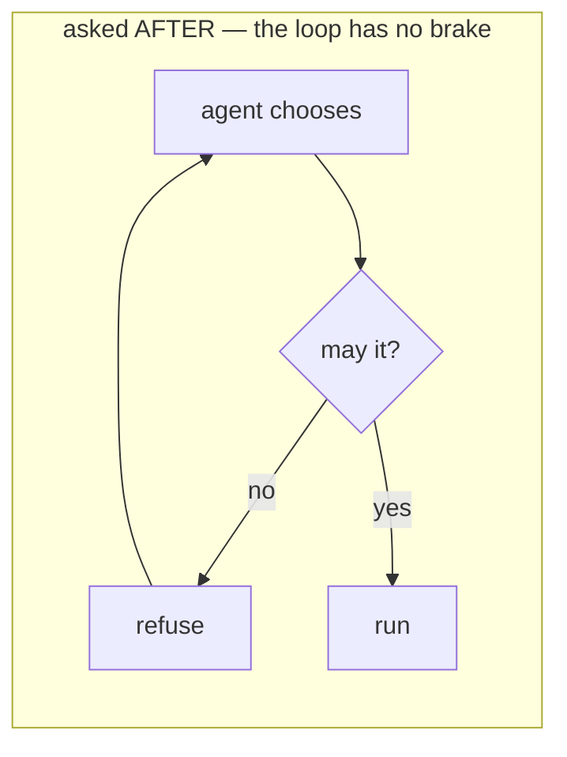
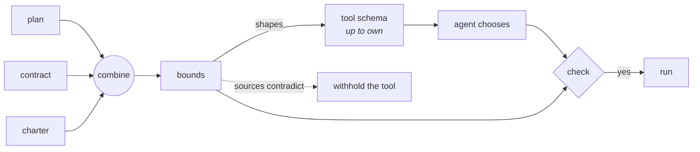
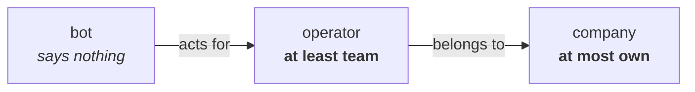
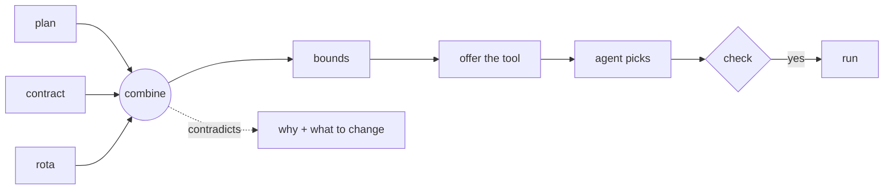

# Scales of reach, for software that decides

## The loop that costs money

An agent proposes, you refuse, it retries. Every retry is a model call you paid
for, and the model does not learn from the refusal inside the same turn — so it
can propose the same thing again.

A single yes/no can only be consulted **after** it has chosen. A range is a
**bound**, so it goes in the tool description before it chooses.





The check afterwards still runs. A model can emit anything. What changes is how
often it fires: from _refuse most_ to _refuse the rare one_.

## Three sources, one tool

```
            none   own   team   region   all
  plan      ●━━━━━━━━━━━━━━━━━━━━━━●
  contract  ●━━━━━━━●
  charter   ●━━━━━━━━━━━━━━━●
  ─────────────────────────────────────────
  offered   ●━━━━━━━●                      up to own
```

Nobody edited anything. The plan file still says what the plan sells.

## Withhold, do not split the difference

When the sources contradict — an add-on sold beyond what the contract allows —
the tool is **withheld**, not served at some plausible middle value.

```
  WITHHELD — sources disagree at [team, region]
```

A contradiction served once becomes a contradiction served always. The company's
own statements disagree; nobody should act until a person resolves it.

## Reaching means holding



An agent running in someone's session is bound by its own charter **and** by
theirs **and** by whatever the company signed. Every hop can only **narrow** —
which is what combining does, so the arrow means what the arithmetic means.

That is the test for whether a graph belongs here at all. A tier that _widens_
(free → pro → enterprise) is not this relation, and folding it as one would cap
enterprise at the free tier.

The finding: each holder reads clean alone, and only the composite contradicts.
Checking holders one at a time cannot find it.

```
            ALONE                  IN THE CHAIN
  bot       none..all              CONFLICT at [team]
  operator  team..all              CONFLICT at [team]
  company   none..own              none..own
```

## Where it goes next

- **Context budget.** A task needs at least _this much_ context to be worth
  answering; the window gives at most _that much_. A crossing says decompose,
  where today it silently truncates and returns something shaped like an answer.
- **Model routing.** A task needs at least _this_ capability; the data may
  travel at most _this_ far. A crossing means refuse, not quietly route to a
  weaker model and return a worse answer nobody labels as degraded.
- **Confidence.** A downstream step requires evidence of at least _this_
  strength; the chain supports at most _that_. A crossing means the pipeline is
  claiming more than it knows.

## Alternatives, as a list

A task can often be done more than one way, and the ways are not one range.

```
          none    own    team   region   all
  cache   ●━━━━━━━━●
  warehouse ··············●━━━━━━━━━●
  offered ●━━━━━━━━●      ●━━━━━━━━━●     two, exactly
```

Handing the agent a single range spanning both would offer `team`, which no
route actually serves. `anyOf` returns the list, so the gap is visible — and
adding a mid-tier route closes it on its own.

Duplicate routes collapse. Routes the contract rules out drop when combined
with it.

## How much a statement says

`complexity` counts the steps a statement demands **and** the steps it limits.
It is not about satisfiability: `(bottom, top)` says nothing and scores zero,
`(top, bottom)` says everything it could and scores the maximum.

Useful for ranking what a system actually declares, and for spotting a rule
that constrains more than anyone needed.

`tool-bounds.ts` · `delegation.ts` · `alternatives.ts`

## One request, end to end

`full-request.ts` runs everything in the order a real handler does.



```
1 · the sources
    plan   none..region   FORBIDDEN  says 1
    dpa    none..own      FORBIDDEN  says 3
    rota   team..all      REQUIRED   says 2

2 · combined
    plan + dpa          none..own   FORBIDDEN
    plan + dpa + rota   team..own   CONFLICT
    stops at            [team]

3 · what to change      { raiseFloorTo: 'team', raiseCeilingTo: 'all' }
4 · routes              none..own   region..all   (a gap at team)
5 · stricter than       dpa ⊨ plan  true
6 · evidence            exact + sample + declared → declared
```

Step 2 is the whole point: the plan and the contract agree, and adding the
rota — a floor, from a scheduled job — is what crosses. Step 3 turns the
refusal into an action instead of an explanation.
