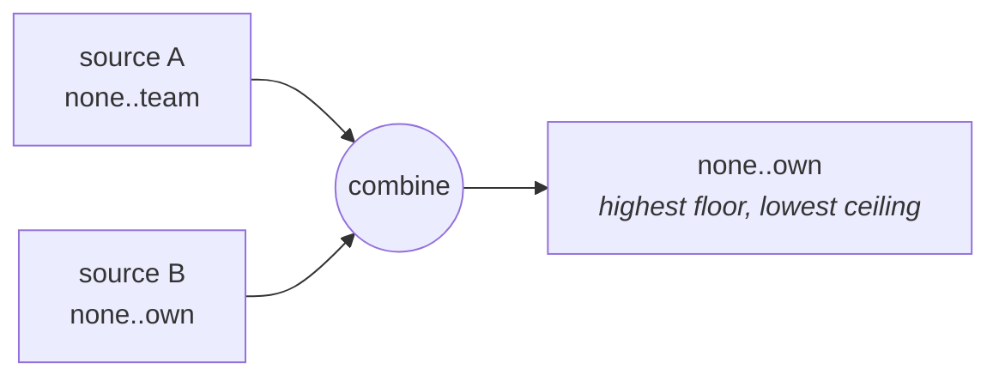
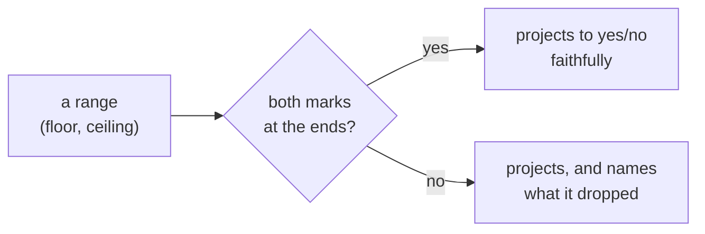
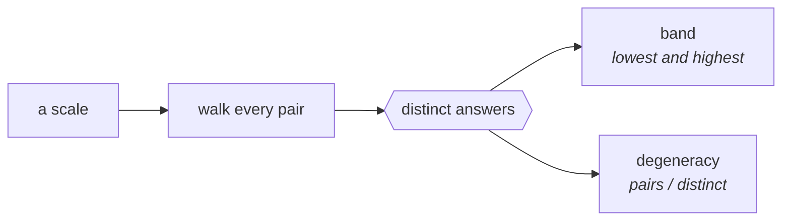

# The arithmetic itself

Start here. Five files, in order.

## quick-start

Two sources, one subject. The lowest ceiling wins and neither source was
edited.

```
         none    own    team   region   all
  A      ●━━━━━━━━━━━━━━━●
  B      ●━━━━━━━●
  ───────────────────────────────────────────
  both   ●━━━━━━━●
```

Put a floor above a ceiling and they cross — a contradiction, and a real one.



## from-a-boolean

A range with both marks at the ends of the scale **is** a yes/no value:

```
  true   ≡  (bottom, top)     accepts everything
  false  ≡  (bottom, bottom)  accepts nothing above the bottom
```

So an existing table of yes/no is valid input on day one. The example ends by
projecting back down to one bit, and the library names what that loses:

```
  (none, team)   FORBIDDEN   → true, LOST: how far
  (team, all)    REQUIRED    → true, LOST: that something depends on it
```

Two of the four outcomes project faithfully. The other two are the ones worth
having.



## any-of

Combining says _all of these must hold_ and lands on one range. _Any of these
may hold_ is a different question, and its answer is a **list** — because two
ranges with a gap between them are not one range.

```
         none    own    team   region   all
  a      ●━━━━━━━━●
  b      ················●━━━━━━━━━●
  anyOf  ●━━━━━━━━●      ●━━━━━━━━━●        two, exactly
```

Ranges merge when merging picks up nothing neither of them accepted, and stay
apart when it would. Nothing is approximated.

One range back means the alternatives really were one. More than one means they
are genuinely separate, and the list says where the gaps are.

## what-do-i-change

After a refusal, the useful question is not _why_ but _what would fix it_.

```
         none    own    team   region   all
  have   ●━━━━━━━━━━━━━━━━●
  want   ················●━━━━━━━━━━━━━●
  need                    raise the ceiling to `all`
```

`null` on a side means that side already holds.

## beyond-a-chain

A scale is usually a ladder. It does not have to be.

```
         both
        /    \        x and y sit side by side,
       x      y       neither above the other
        \    /
         none
```

Combining and the four outcomes work here too. What a plain ladder buys is that
combining costs nothing to work out — and the example prints the difference
under three unrelated ways of valuing a level.

### Knowing before you measure

Combining two statements gives a lower floor and a higher ceiling than either
had. How much lower and how much higher are the two **slacks**, and they decide
what is left over _before_ anybody says what a level is worth:

```
  up = 0 and down = 0   nothing is left over, for ANY way of valuing levels
  down = 0              what is left over has one known sign
  up = 0                it has the other
```

```ts
slack(ladder, a, b); // { up: 0, down: 0 } — always, on a ladder
slack(powerset, x, y); // { up: 1, down: 1 } — the side-by-side pair
```

That first line is why this library can answer on its own for a plain ladder:
the property is visible from the scale alone, with no valuation, no
measurement and no scan.

### What a scale can even produce

Walk every pair of levels, work out what combining them leaves over, and count
the distinct answers. Two things fall out, and both are about the **scale**
rather than about any statement on it.



```
ladder of 4     pairs 10   distinct 1   band [0, 0]     10.0x
powerset 2x2    pairs 10   distinct 2   band [-4, 0]     5.0x
```

**A ladder produces one answer: nothing.** Whatever you decide a level is
worth. That is the property this library rests on, arrived at by counting
rather than by proof.

Degeneracy is how many pairs land on the same answer. Worth knowing before you
build a report that ranks by it — high degeneracy means most of the ranking is
a tie.

And the other scale does **not** always spread. Value its levels by counting
and it collapses to one answer too; value them another way and it does not. So
the honest statement is that a ladder has no way of spreading, and this one has
some.
