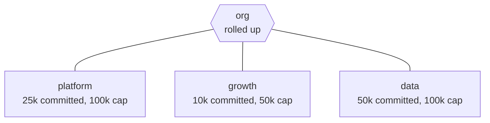

# Scales of a conserved quantity

Money, compute quota, carbon, seats, headcount. Anything there is a fixed
amount of.

Each team has a **floor** — what it has already committed — and a **ceiling** —
what it is allowed to spend.



Roll them up and the crossing arrives **before** the quarter does.

```
        0     10     25     50    100    250
platform ·············●━━━━━━━━━━━━━●
growth   ······●━━━━━━━━━━━━━━●
data     ····················●━━━━━━●
──────────────────────────────────────────────
org      ····················●          50k
```

Let `data` sign a contract committing 250k and the floor climbs past the group
ceiling:

```
CONFLICT: floor 250k is above ceiling 50k
```

## "We are over" is not actionable

Where matters more than how much. Splitting the overrun over its pieces says
which subtree carries it:

```
of the overrun, 100% sits in `data`
```

That is the difference between _we are twelve per cent over_ and _one team
carries all of it_ — the first starts a meeting, the second starts a fix.

The split is checked against the total it explains. One that does not add back
is refused, because a dropped piece would report a smaller, friendlier number
with nothing to notice it.

`tree.ts`
