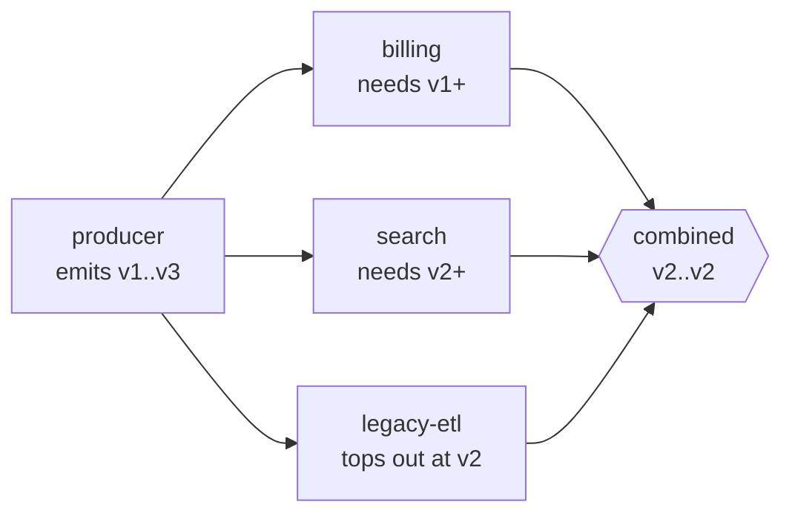

# Scales of shape

A producer emits: that is a **ceiling** — the most that can appear in its
output. A consumer needs: that is a **floor** — the least it can work with.



Combine every consumer and the answer covers all of them at once — which is
the question you actually have before a deploy, and the one nobody can answer
by reading three services.

```
        v1     v2     v3     v4
producer ●━━━━━━━━━━━━━●
billing  ●━━━━━━━━━━━━━━━━━━━━●
search   ·······●━━━━━━━━━━━━━●
legacy   ●━━━━━━━●
─────────────────────────────────
together ·······●              v2 only
```

## The thing a registry does not record

Schema registries record what a producer **emits**. Nothing records that a
consumer **depends** on a field.

Deleting a field nobody reads is safe. Deleting one somebody depends on has to
fail loudly — and today that distinction lives in people's heads, which is why
it survives review and dies in production.

The floor is that distinction, written down.

## Dropping support, step by step

```
after dropping v1:  still fine — legacy-etl and the producer meet at v2
after dropping v2:  CONFLICT   — nothing satisfies legacy-etl any more
```

And after a refusal, `missing` says what each consumer would need rather than
just that it broke.

`compatibility.ts`
