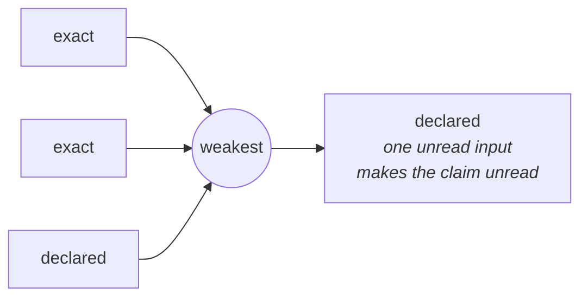

# Scales of duration, of evidence, of cost

## retention — keep versus delete

```
         now   30d   90d   1y   7y   forever
  keep   ·····················●━━━━━━━━━●     a statute: at least 7 years
  forget ●                                    a regime: it must be deletable
  ────────────────────────────────────────────
         └────── contested ──────┘
```

Both statements are real, both are about the same record, and they cannot both
be satisfied. Almost nothing can represent that, so it usually resolves as
whichever job runs last.

Note which mark is which: **keep is a floor** and **forget is a ceiling**. A
system that files them in the same column cannot cross them, and so cannot see
this at all.

## provenance — a claim is worth its weakest input

```
  declared ─── statistics ─── sample ─── exact
     │                                     │
  absorbs                              identity
```



One `declared` input drags a whole claim down to `declared`. That absorption is
the guard against an estimate wearing the clothes of a measurement.

It is not a second mechanism: it is the same combining, on a scale of methods.

## where-the-price-is — how bad, and where

One number says how bad. It never says where. Splitting it over its pieces
does, and what makes the split trustworthy is the law it is checked against:

```
  total = Σ  share · cost
```

```
  concentrated   total 2.50  worst one tenant  80%
  spread out     total 2.50  worst a           50%
```

Same total, and only the first has somewhere to point. A split that does not
add back is decoration, so building one that does not is refused.
