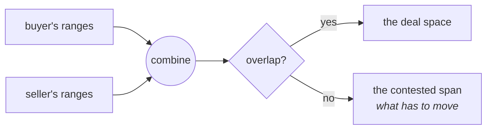

# Finding agreement, not refusing it

The same arithmetic, used the other way round. Everywhere else a crossing is a
failure to report; here it is a **list of things to negotiate**.



Each side states, per clause, a range it can live with.

```
clause      buyer            seller           together
term        1 month..1 year  1 year..3 years  1 year..1 year
volume      10k..100k        100..100k        10k..100k
penalty     5x..20x          none..1x         NO OVERLAP
```

Two of three clauses agree without anyone doing anything. Only `penalty`
blocks, and the useful output is not "no deal" but:

```
penalty   nothing works in [5x]
          one side must cross it: buyer down from 5x, or seller up from 1x
```

## The question `missing` does not answer

`missing` says how to **widen** to cover something. A party conceding has to
**narrow**. Reaching for it here reported "nothing to change" while the buyer
clearly had to move — the contested span is what both sides actually need.

Worth remembering when picking between them: `missing` is for _I want to reach
that_, the contested span is for _we cannot both hold_.

## Alternatives keep the gaps honest

A side can offer structures rather than one range:

```
1 month..6 months     short, higher rate
3 years..3 years      long, discounted
(2 ranges — nothing in between is on the table)
```

Collapsing those into `1 month..3 years` would put an eighteen-month deal on
the table that nobody offered. `anyOf` keeps them apart.

## How hard each side is pushing

`complexity` counts what a statement pins down. Summed across clauses it says
which side has left itself less room — before anyone says who is being
difficult.

`negotiate.ts`
