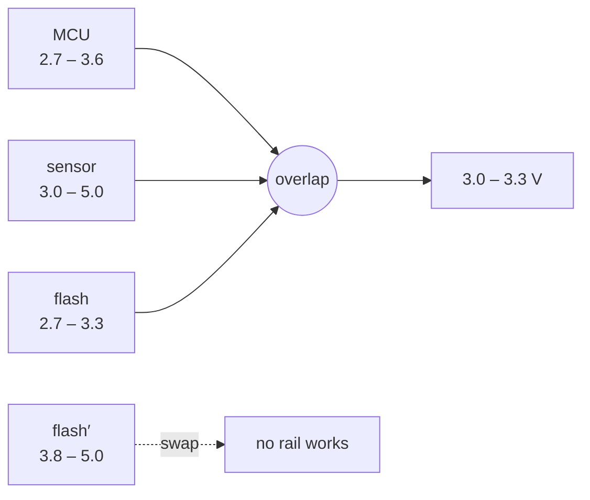
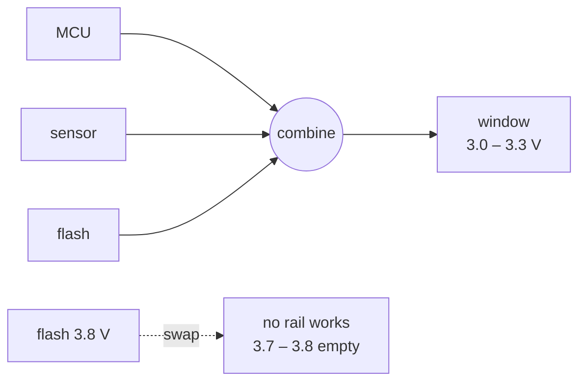

# Scales of volts, and of time

The most literal fit, because the ranges are physical and somebody already
wrote them down.

## The supply window

Every part on a rail gives a minimum it will operate at and an absolute maximum
it will survive. The board works where all of them overlap.

```
           2.7    3.0    3.3    3.6    5.0
  MCU      ●━━━━━━━━━━━━━━━━━━━━━●
  sensor   ·······●━━━━━━━━━━━━━━━━━━━━━●
  flash    ●━━━━━━━━━━━━━━●
  ─────────────────────────────────────────
  window   ·······●━━━━━━━●                 3.0 – 3.3 V
```

Swap the flash for a 3.8 V part and the floor climbs above the MCU's ceiling:

```
  → CONFLICT: floor 3.8 above ceiling 3.6
```

No rail supplies that board. The numbers were on three datasheets, and the
composition is exactly what nobody redoes by hand on the fourth revision.



## Timing

Setup time is a floor and hold time is a ceiling, on the same clock edge. A
crossing is timing closure failing, and the contested set is the range of clock
periods where nothing works — which is more actionable than a pass/fail.

## Thermal, current, slew

Junction temperature. Current limits. Rise times. Every one is a range from a
datasheet, and every board is a composition of them.

## Why encode it

A datasheet range is written once and consulted by many people over years. The
composition is done by hand every time, from PDFs, by whoever is doing the
review that week.

`supply-window.ts`

## A board review, end to end

`board-review.ts` does the same walk with no software in it at all.



```
2 · the window          3.0 .. 3.3 V   REQUIRED
3 · swap the flash      CONFLICT — no rail in [3.7 .. 3.8] works
5 · which part binds
    without MCU     3.0 .. 3.3 V     (unchanged — not the binding one)
    without sensor  2.7 .. 3.3 V
    without flash   3.0 .. 3.6 V
7 · the scale itself    496 pairs → 1 distinct outcome, band [0, 0]
```

Step 5 is the review question: **which part is actually setting the limit.**
Drop each in turn and see which one moves the window — the same leave-one-out
that finds a bad instrument in `sensors/`.

Step 7 is about the scale, not the board: a voltage ladder never leaves
anything over, whatever you decide a volt is worth.
