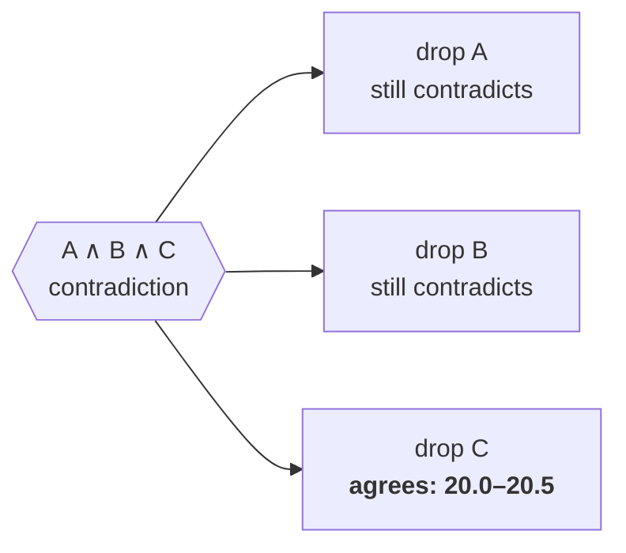

# Scales of measurement

A reading is not a number. It is a **range**: the value, plus the error the
instrument admits to.

```
        19.5   20.0   20.5   21.0   21.5   22.0
  A     ●━━━━━━━━━━━━━━●                             20.0 ± 0.5
  B     ·······●━━━━━━━━●                            20.3 ± 0.3
  C     ····························●━━━━━━━━●       21.8 ± 0.4
```

## Finding the broken one, with no reference

Two instruments measuring the same thing **must** overlap. If they do not, at
least one is wrong by more than it claims — and that is detectable without a
calibrated standard, without a reference thermometer, without knowing the true
value at all.

Combine all three and you get a contradiction. Then **leave one out**:

```
  without A    the rest still disagree
  without B    the rest still disagree
  without C    the rest agree on 20.0..20.5
```



Exactly one of those clears it, and that names the instrument to recalibrate.

Nothing in that procedure consulted a truth. It is a statement about the
_consistency of the claims_, which is why it works when you have no way to
check them.

## Where it goes next

The same shape covers any two things claiming to measure one thing:

- two models estimating the same quantity, with stated confidence intervals
- two annotators labelling the same item, each with a tolerance
- a cached value and a fresh one, each with a staleness window

In every case a crossing means _the claims are inconsistent_, which is a
stronger and more useful thing to know than _the numbers differ_.

## Note on resolution

This example uses `compose`, not the packed form. Thirty-six levels is
thirty-five steps and the fast form holds thirty-two. Resolution is a property
of your instruments; the plain form has no such limit.

`disagreement.ts`
